# [EdgeUtils](https://github.com/JailedBird/EdgeUtils)

EdgeUtils是基于androidx.core的Android沉浸式框架 :package:

接入方式： 
```
implementation 'com.github.JailedBird:EdgeUtils:0.0.1'
```

使用方式

1、Activity中使用API `edgeToEdge()`  将开发者实现的布局拓展到整个屏幕， 同时为避免冲突， 将状态栏和到导航栏背景色设备为透明；

注意：`edgeToEdge()` 的参数withScrim表示是否启用系统默认的反差色保护， 不是很熟悉的情况下直接使用默认true即可；

2、 布局拓展之后， 开发者布局内容会显示在状态栏和导航栏区域， 造成布局和系统栏字体重叠（时间、电量……）；

此时为确保系统栏字体可见，应该设置其字体； 设置规则：白色（浅色）背景设置黑色字体（`edgeSetSystemBarLight(true)`），黑色（深色）背景设置白色字体（注：系统栏字体只有黑色和白色）（`edgeSetSystemBarLight(false)`）；

如果未作夜间模式适配， 默认使用 `edgeSetSystemBarLight(true)`浅色模式即可！

综合1、2我们的基类可以写成如下的形式：

```
abstract class BasePosActivity : AppCompatActivity() {

    override fun onCreate(savedInstanceState: Bundle?) {
        if (usingEdgeToEdgeTheme()) {
                defaultEdgeToEdge()
        } else {
            customThemeSetting()
        }
        super.onCreate(savedInstanceState)
    }
}

protected open fun defaultEdgeToEdge() {
      edgeToEdge(false)
      edgeSetSystemBarLight(true)
}
```


3、 状态栏适配

步骤一的重合会导致视觉上的冲突， 下面是几种常见的思路：请灵活使用

- 布局中添加View（id="@+id/edge"）使用heightToTopSystemWindowInsets API动态监听并修改View的高度为状态栏的高度

  ```
  <LinearLayout xmlns:android="http://schemas.android.com/apk/res/android"
          android:orientation="vertical">
  
          <View
              android:id="@+id/edge"
              android:layout_width="match_parent"
              android:layout_height="0dp" />
          xxx
      </LinearLayout>
  binding.edge.heightToTopSystemWindowInsets()
  ```


- 直接获取状态栏的高度，API为：edgeStatusBarHeight； 和1不同的是，1中View的height会随状态栏高度变化而变化，2不会； 此外获取状态栏高度需要在View Attached之后才可以（否则高度为0），因此使用suspend函数等待Attached后才返回状态栏，确保在始终能获取到正确的状态栏高度！

  ```
  lifecycleScope.launch {
      val height = edgeStatusBarHeight()
      xxx
  }
  ```

- 针对有Toolbar的布局， 可直接为Toolbar加padding（or margin）， 让padding的高度为状态栏高度！如果无效， 一般都与Toolbar的高度测量有关， 可以直接在Toolbar外层包上FrameLayout，为FrameLayout加padding， 详情阅读下文了解原理，从而灵活选择；

  ```
  fun View.paddingTopSystemWindowInsets() =
      applySystemWindowInsetsPadding(applyTop = true)
  
  
  fun View.paddingBottomSystemWindowInsets() =
      applySystemWindowInsetsPadding(applyBottom = true)
  
  
  fun View.paddingVerticalSystemWindowInsets() =
      applySystemWindowInsetsPadding(applyTop = true, applyBottom = true)
      
  fun View.marginTopSystemWindowInsets() =
      applySystemWindowInsetsMargin(applyTop = true)
  
  
  fun View.marginBottomSystemWindowInsets() =
      applySystemWindowInsetsMargin(applyBottom = true)
  
  
  fun View.marginVerticalSystemWindowInsets() =
      applySystemWindowInsetsMargin(applyTop = true, applyBottom = true)
  ```

  

4、 导航栏适配和状态栏的适配原理类似，API也类似，不在赘述； 可以去看三个demo项目！后续篇幅为原理和细节，请仔细阅读。


---


[TOC]

文章会分为4个部分讲解Edge to edge的适配思路和EdgeUtils工具类

- 前言简介
  - Window Insets相关的知识
  - 传统沉浸式方案对比
- Edge to Edge
  - google官方edge适配的思路
  - 具体的代码做法
- EdgeUtils框架 :golf:
  - 框架API设计和实现
  - 基于edge和实际代码说明具体的适配方法
- 注意事项
  - 待优化的点
  - 缺陷和需要注意的事项


## 前言简介

注：鉴于这是内部资料，所以 [前言简介](#前言简介) 部分直接拷贝自[Flywith24](https://juejin.cn/user/219558054476792)的文章 [Android Detail:Window 篇-WindowInsets & fitsSystemWindow](https://juejin.cn/post/7038422081528135687) ，存在部分删减， 需要深入理解这一部分内容的同学可以看原文；


### 什么是Window

在 [Android Detail：Window 篇——站在 Window 视角理解 Activity 任务与返回栈](https://link.juejin.cn?target=https%3A%2F%2Fxiaozhuanlan.com%2Ftopic%2F3268795140) 一文中我们讨论过 Android Window 的核心概念并得到一个结论：

在 Android 中，暴露给开发者操作 UI 界面的 API 是 `mWindowManager.addView(rootView, windowParams);`

简单说，**Android 屏幕上的每一个 view 都是在 Window 内的**。

- 每个 Activity 有着自己的 Window（PhoneWindow），`Activity#getWindow()`
- Dialog 也有自己的 Window，`Dialog#getWindow()`
- PopupWindow、Toast 也是通过 `WindowManager#addView` 将 view 置于 Widnow 上的**（注意：它们没有自己的Window）**


### 什么是 Insets

屏幕上除了开发者 app 绘制的内容还有系统的 Insets（插入物），Insets 区域负责描述屏幕的哪些部分会与**系统 UI 相交**。如 `Starus bar` 或 `Navigation bar`：


**Figure1**

**上述的日志可以使用 `adb shell dumpsys activity top > ./test.log`** 导出, 日志的InsetsController结构中就会出现相关交叉部分的坐标

```
    InsetsController:
      InsetsState
        mDisplayFrame=Rect(0, 0 - 1080, 2400)
          InsetsSource type=ITYPE_STATUS_BAR frame=[0,0][1080,84] visible=true
          InsetsSource type=ITYPE_NAVIGATION_BAR frame=[0,0][0,0] visible=false
          InsetsSource type=ITYPE_LEFT_GESTURES frame=[0,0][0,0] 
          InsetsSource type=ITYPE_IME frame=[0,0][0,0] visibleFrame=[0,1417][1080,2400] visible=false
```

> 常见的 Insets 有：
>
> - `STATUS_BAR`，用于展示系统时间，电量，wifi 等信息
> - `NAVIGATION_BAR`，虚拟导航栏（区别于实体的三大金刚键），形态有**三大金刚键导航，手势导航**两种。（有些设备形态如 TV 没有导航栏）
> - `IME`，软键盘，用于输入文字

其中 `STATUS_BAR` 与 `NAVIGATION_BAR` 又被称为 `System bar`。

**（注：这是通过Insets解决问题的核心思路）如果开发者绘制的内容出现在了系统 UI 区域内，就可能出现视觉与手势的冲突。开发者可以借助 Insets 把 view 从屏幕边缘向内移动到一个合适的位置。**

在源码中，Insets 对象拥有 4 个 int 值，用于描述矩形四个边的偏移：


**Figure2**


> 📢 注意：不要把 Insets 的 `top` ，`bottom`，`left`，`right` 与 Rect 的搞混，前者描述的是**偏移**，后者是**坐标**。

关于 Insets 更详尽的信息，可以 [查看这篇文章](https://juejin.cn/post/6844904006343458830)。


### WindowInsets

`WindowInsets` 描述了一组 Window Content 的 Insets，未来可能会继续添加新的 Insets 类型。目前已有的 Insets 类型有：

```
static final int FIRST = 1 << 0;
        static final int STATUS_BARS = FIRST;
        static final int NAVIGATION_BARS = 1 << 1;
        static final int CAPTION_BAR = 1 << 2;

        static final int IME = 1 << 3;

        static final int SYSTEM_GESTURES = 1 << 4;
        static final int MANDATORY_SYSTEM_GESTURES = 1 << 5;
        static final int TAPPABLE_ELEMENT = 1 << 6;

        static final int DISPLAY_CUTOUT = 1 << 7;
```

`systemBars` API中包括 `Status bar`，`Navigation bar`，`Caption bar` (手势导航条模式)，但**不包括软键盘**（`ime`）, 当然开发者也通过位运算来任意组合这些insets

```
public static @InsetsType int systemBars() {
            return STATUS_BARS | NAVIGATION_BARS | CAPTION_BAR;
        }
```

上述**Figure1**中标注的状态栏和导航栏就对应 STATUS_BARS和NAVIGATION_BARS


### onApplyWindowInsets 与 setOnApplyWindowInsetsListener

了解了windows Insets, 那么如何通过insets实现沉浸式适配呢？ 

**开发者可以通过在自定义 View 中重写 `onApplyWindowInsets()` 方法或调用 `setOnApplyWindowInsetsListener()` 来监听 `WindowInsets` 的变化，通过对 View 添加 `margin` 或 `padding` 的方式处理解决冲突**。

这两个方法是互斥的，当存在 `OnApplyWindowInsetsListener` 时不会执行 `onApplyWindowInsets`：

```
public WindowInsets dispatchApplyWindowInsets(WindowInsets insets) {
        try {
            mPrivateFlags3 |= PFLAG3_APPLYING_INSETS;
            if (mListenerInfo != null && mListenerInfo.mOnApplyWindowInsetsListener != null) {
                return mListenerInfo.mOnApplyWindowInsetsListener.onApplyWindowInsets(this, insets);
            } else {
                return onApplyWindowInsets(insets);
            }
        } finally {
            mPrivateFlags3 &= ~PFLAG3_APPLYING_INSETS;
        }
    }
```


### System bar 能力变化史

篇幅过长，请直接查看原文 [Android 4.4到现在的System Bar变化](https://juejin.cn/post/7038422081528135687#heading-4)


### setSystemUiVisibility 与 WTFs

View 的源码中有一个 `setSystemUiVisibility() ` 的方法，虽然**该方法在 Android 11 已被弃用**，但按照本专栏的一贯风格，我们还是要来介绍一下该方法。

有些场景开发者可能希望 app 的内容可以绘制到状态栏或导航栏的区域以提供更好的用户体验，因此系统提供了 `setSystemUiVisibility` 方法，开发者可以通过向该方法传入不同的 flag 以应对不同的使用场景。

这些 flag 被称为 `Window Transform Flags`，简称 WTFs（滑稽脸😏），同样的，它们在 Android 11 中被弃用。常用的 flag 如下：

```
	@Deprecated
    public static final int SYSTEM_UI_FLAG_VISIBLE = 0;
    @Deprecated
    public static final int SYSTEM_UI_FLAG_LOW_PROFILE = 0x00000001;
    @Deprecated
    public static final int SYSTEM_UI_FLAG_HIDE_NAVIGATION = 0x00000002;
    @Deprecated
    public static final int SYSTEM_UI_FLAG_FULLSCREEN = 0x00000004;
    @Deprecated
    public static final int SYSTEM_UI_FLAG_LAYOUT_STABLE = 0x00000100;
    public static final int SYSTEM_UI_FLAG_LAYOUT_HIDE_NAVIGATION = 0x00000200;
    @Deprecated
    public static final int SYSTEM_UI_FLAG_LAYOUT_FULLSCREEN = 0x00000400;
    @Deprecated
    public static final int SYSTEM_UI_FLAG_IMMERSIVE = 0x00000800;
    @Deprecated
    public static final int SYSTEM_UI_FLAG_IMMERSIVE_STICKY = 0x00001000;
    @Deprecated
    public static final int SYSTEM_UI_FLAG_LIGHT_STATUS_BAR = 0x00002000;
    private static final int SYSTEM_UI_RESERVED_LEGACY1 = 0x00004000;
    private static final int SYSTEM_UI_RESERVED_LEGACY2 = 0x00010000;
    @Deprecated
    public static final int SYSTEM_UI_FLAG_LIGHT_NAVIGATION_BAR = 0x00000010;
    @Deprecated
    public static final int STATUS_BAR_HIDDEN = SYSTEM_UI_FLAG_LOW_PROFILE;
    @Deprecated
    public static final int STATUS_BAR_VISIBLE = SYSTEM_UI_FLAG_VISIBLE;
```

参数非常之多，且他们之前相互依赖、制约，导致效果多变、不稳定； 网络上也没几个人说的清楚，用起来一言难尽 :fu:


#### 获取 System bar 和 软键盘的高度

#### ❌ **错误(野路子)用法**

-  🙅🏻‍♀️固定 status bar 的高度，不同 Android 版本 `status bar` 的高度是不同的！不同设备也可能定制自己的高度。
-  🙅🏻‍♀️读取系统内部资源（framework 的 `dimens.xml` 存储了系列系统内部资源）				

`ImmersionBar`获取状态栏高度的方案：

```
static int getInternalDimensionSize(Context context, String key) {
        int result = 0;
        try {
            int resourceId = Resources.getSystem().getIdentifier(key, "dimen", "android");
            if (resourceId > 0) {
                int sizeOne = context.getResources().getDimensionPixelSize(resourceId);
                int sizeTwo = Resources.getSystem().getDimensionPixelSize(resourceId);

                if (sizeTwo >= sizeOne && !(Build.VERSION.SDK_INT >= Build.VERSION_CODES.Q &&
                        !key.equals(IMMERSION_STATUS_BAR_HEIGHT))) {
                    return sizeTwo;
                } else {
                    float densityOne = context.getResources().getDisplayMetrics().density;
                    float densityTwo = Resources.getSystem().getDisplayMetrics().density;
                    float f = sizeOne * densityTwo / densityOne;
                    return (int) ((f >= 0) ? (f + 0.5f) : (f - 0.5f));
                }
            }
        } catch (Resources.NotFoundException ignored) {
            return 0;
        }
        return result;
    }
```


`Blankj` 获取状态栏高度

```
public static int getStatusBarHeight() {
        Resources resources = Resources.getSystem();
        int resourceId = resources.getIdentifier("status_bar_height", "dimen", "android");
        return resources.getDimensionPixelSize(resourceId);
    }
public int getDimensionPixelSize(@DimenRes int id) throws NotFoundException {
        final TypedValue value = obtainTempTypedValue();
        try {
            final ResourcesImpl impl = mResourcesImpl;
            impl.getValue(id, value, true);
            if (value.type == TypedValue.TYPE_DIMENSION) {
                return TypedValue.complexToDimensionPixelSize(value.data, impl.getDisplayMetrics());
            }
            throw new NotFoundException("Resource ID #0x" + Integer.toHexString(id)
                    + " type #0x" + Integer.toHexString(value.type) + " is not valid");
        } finally {
            releaseTempTypedValue(value);
        }
    }
```


**「野路子」代码可能有效，但不健壮。**

#### ✅ 正确用法

使用 `WindowInsets#getInsets(type)` 获取对应 Insets，通过 Insets.top 或 Insets.bottom 获取 `System bar` 高度


### 总结

- 官方的API不香么:+1:


## Edge To Edge

默认情况下，应用布局在顶部的状态栏(status bar)下方和底部导航栏(navigation bar)上方, 状态栏和导航栏一起称为系统栏(system bar)。但是应用可以将内容绘制到系统栏。**Edge-to-edge**中文释义是"边到边"， 如下图所示， "边到边"本质就是将应用内容(图中绿色部分)绘制到系统栏（图中白色位置）的位置，以此充分占用屏幕， 使其达到沉浸式的目的。


**Figure 3: System bars with edge-to-edge**

**Window insets** 即是系统UI和应用之间的相交、重叠的区域（上图白色区域， 表示Window insets的status bar和 navigation bar相交部分）


在应用中实现edge-to-edge的步骤如下：

1. Lay out your app full-screen. 
2. Change the system bar colors and transparency. 
3. Handle any visual overlaps. 


### Step 1: Lay out your app in full screen

这是确保应用实现edge-to-edge的主要步骤，使用 [WindowCompat.setDecorFitsSystemWindows(window, false)](https://developer.android.com/reference/androidx/core/view/WindowCompat#setDecorFitsSystemWindows(android.view.Window, boolean)) 将应用布局拓展到系统栏后面实现[**Figure 1**]的效果，代码如下 :arrow_down:

```
override fun onCreate(savedInstanceState: Bundle?) {
    super.onCreate(savedInstanceState)
    WindowCompat.setDecorFitsSystemWindows(window, false)
}
```


### Step 2: Change the system bar colors and transparency

在edge-to-edge布局中，应用需要更改导航栏和状态栏的颜色，以允许系统栏下面的应用内容可见， 默认建议直接将其设置透明；

应用执行此步骤后，系统会在手势导航模式（**Gesture navigation mode**）或按钮模式(**Button navigation mode**)下处理用户界面的所有视觉保护。

- 手势导航模式：系统导航条颜色根据其后面的内容改变颜色。在下面的示例中，如果导航栏中的控点高于浅色内容，则导航栏中的控点将更改为深色，反之亦然***（不要试图通过Api去改动这个颜色 一是不能、二是没必要）***

  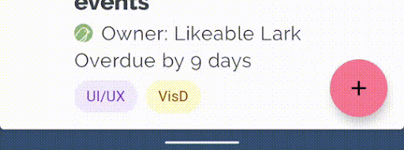

  **Figure 4**: Handle color changes in gesture navigation mode

- 按钮模式：系统在系统栏（对于 API 级别 29 或更高）或透明系统栏（对于 API 级别 28 或更低）后面应用半透明遮盖布局（scrim）***（将状态栏颜色设置为任意非透明颜色即可干掉这个半透明遮盖布局)***

  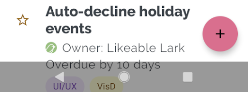

   **Figure 5**: Translucent scrim behind system bars

  

- 状态栏内容颜色：此时状态栏透明， 应用内容会呈现在状态栏位置， 产生视觉冲突

  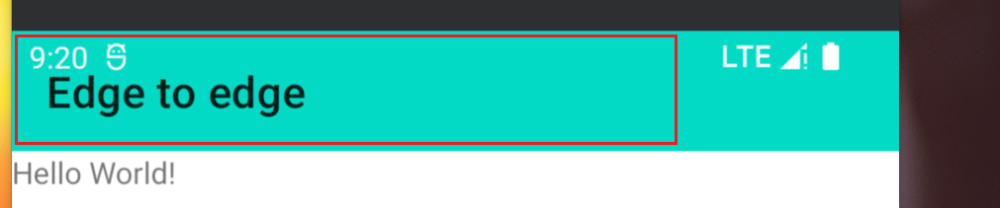

  **Figure 6**: Status bar content color

  


**颜色控制具体步骤：**

编辑主题.xml文档以确保导航栏的颜色，并可选择将状态栏设置为透明，将状态栏内容颜色设置为深色*(建议通过代码去控制而非xml主题)*

```xml
<!-- values-v29/themes.xml -->
<style name="Theme.MyApp">
  <item name="android:navigationBarColor">
    @android:color/transparent
  </item>

  <!-- Optional: set to transparent if your app is drawing behind the status bar. -->
  <item name="android:statusBarColor">
    @android:color/transparent
  </item>

  <!-- Optional: set the status bar light and content dark. -->
  <item name="android:windowLightStatusBar">
    true
  </item>
</style>
```

可以使用  [WindowInsetsControllerCompat](https://developer.android.com/reference/androidx/core/view/WindowInsetsControllerCompat) API 而不是主题.xml来控制状态栏内容颜色。为此，请使用 [setAppearanceLightNavigationBars()](https://developer.android.com/reference/androidx/core/view/WindowInsetsControllerCompat#setAppearanceLightNavigationBars(boolean)) 函数，传入 true（将导航的前景色更改为浅色）或 false（设置为深色导航栏）

```
val windowInsetsController =
    ViewCompat.getWindowInsetsController(window.decorView)

windowInsetsController?.isAppearanceLightNavigationBars = true
```

通过Window的API可以直接改变状态栏颜色

```
private fun Window.edgeSetNavigationBarColor(@ColorInt colorInt: Int) {
        this.navigationBarColor = colorInt
    }
private fun Window.edgeSetStatusBarColor(@ColorInt colorInt: Int) {
        this.statusBarColor = colorInt
    }
```


### Step3：Handle any visual overlaps. 

实现具有颜色透明度的edge-to-edge布局后，应用的某些视图可能会绘制在系统栏后面


您可以通过对*insets* 监听来解决重叠问题，insets指定屏幕的哪些部分与系统 UI 相交，例如导航栏或状态栏；insets的相交含义不仅仅是视觉内容相交，也可以呈现和系统手势交互上的相交；


适用于从edge-to-edge显示应用的insets类型包括：  

- **System bars insets**: 这些insets描述可点击且不应被系统栏在视觉上遮挡的区域
- **System gesture insets**: 这些insets描述系统使用的优先于应用的手势导航区域


如：

- System bars insets
  - STATUS_BARS
  - NAVIGATION_BARS
  - CAPTION_BAR
  - IME
  - ...

- System gesture insets
  - SYSTEM_GESTURES
  - ...


#### System bars insets

System bar insets是最常用的insets类型，单纯的表示视觉上的交叉部分


例如，以下示例中的浮动操作按钮 （FAB） 被导航栏部分遮挡。

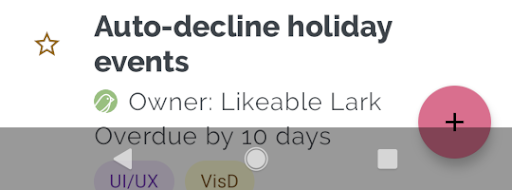

**Figure 7**: Navigation bar after edge-to-edge is implemented, with a visual overlap of the FAB


若要避免在手势模式或按钮模式下由edge-to-edge引起的这种视觉重叠，可以通过将  [getInsets(int)](https://developer.android.com/reference/androidx/core/view/WindowInsetsCompat#getInsets(int)) 与 [WindowInsetsCompat.Type.systemBars()](https://developer.android.com/reference/androidx/core/view/WindowInsetsCompat.Type#systemBars()) 一起使用来增加视图的边距。将此解决方案应用于图 6 中所示的示例将消除按钮模式和手势导航模式的视觉重叠，如Figure 7和Figure 7所示


**Figure 8**: Resolving visual overlap for button modes


 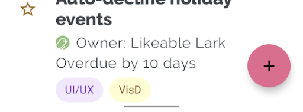

**Figure 9**: Resolving visual overlap for gesture navigation mode (right)


上述效果的演示代码：

```kotlin
ViewCompat.setOnApplyWindowInsetsListener(view) { view, windowInsets ->
    val insets = windowInsets.getInsets(WindowInsetsCompat.Type.systemBars())
    // Apply the insets as a margin to the view. Here the system is setting
    // only the bottom, left, and right dimensions, but apply whichever insets are
    // appropriate to your layout. You can also update the view padding
    // if that's more appropriate.
    view.updateLayoutParams<MarginLayoutParams>(
      leftMargin = insets.left,
      bottomMargin = insets.bottom,
      rightMargin = insets.right,
  )

    // Return CONSUMED if you don't want want the window insets to keep being
    // passed down to descendant views.
    // WindowInsetsCompat.CONSUMED
    insets                                             
}
```


#### System gesture insets

System gesture insets表示窗口区域如下图的橙色所示，其中系统手势优先于您的app

 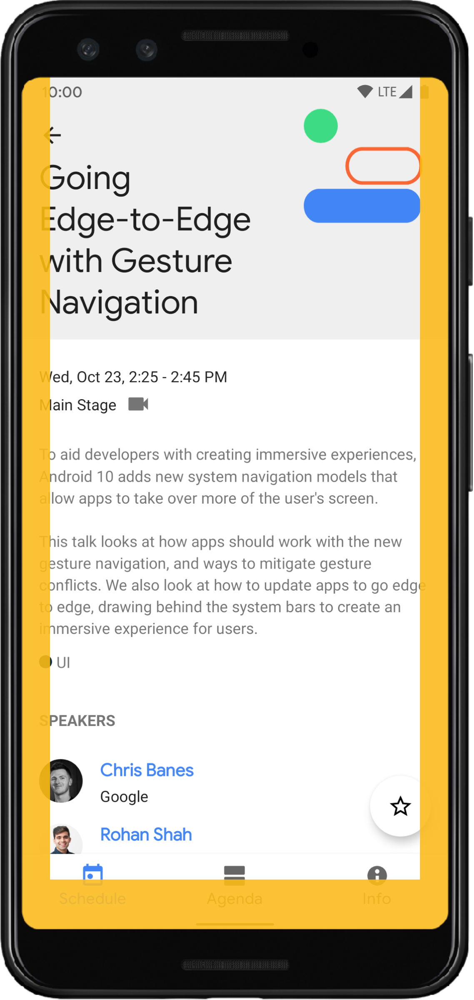

**Figure 10**: System gesture insets

使用这些insets可将可轻扫视图(swipeable views )从边缘移开或填充。常见用例包括 [bottom sheets](https://material.io/design/components/sheets- bottom),、在游戏中滑动和使用 [ViewPager](https://developer.android.com/reference/androidx/viewpager2/widget/ViewPager2) 实现的轮播。


在 Android 10 或更高版本上，系统手势insets包含用于主页手势的底部insets，以及用于后退手势的左右insets：

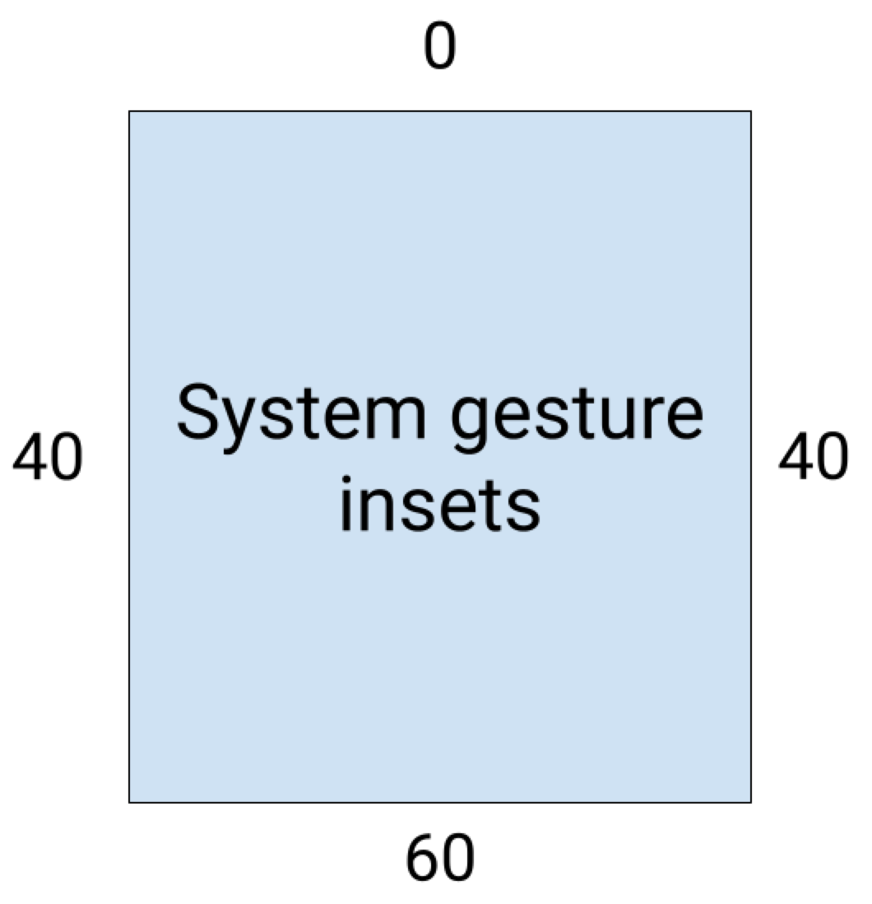

**Figure 11**: System gesture inset measurements

```kotlin
ViewCompat.setOnApplyWindowInsetsListener(view) { view, windowInsets ->
    val insets = windowInsets.getInsets(WindowInsetsCompat.Type.systemGestures())
    // Apply the insets as padding to the view. Here we're setting all of the
    // dimensions, but apply as appropriate to your layout. You could also
    // update the views margin if more appropriate.
    view.updatePadding(insets.left, insets.top, insets.right, insets.bottom)

    // Return CONSUMED if we don't want the window insets to keep being passed
    // down to descendant views.
    // WindowInsetsCompat.CONSUMED
    windowInsets
}
```


### Step4：(Optional) Hide system bars for immersive mode

某些页面最好使用无状态栏、无导航栏的全屏去展示。如一些示例包括视频、游戏、图像库、书籍和幻灯片, 这称为沉浸式模式。这些页面通过全屏内容更深入地吸引用户。


 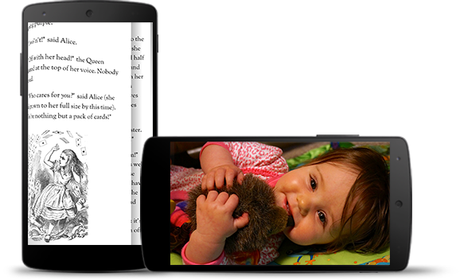

**Figure12**: immersive mode sample 


请注意用户跳入和跳出应用以检查通知、执行即兴搜索或其他操作的频率。由于使用沉浸式会导致用户无法访问系统导航，因此仅当对用户体验的好处不仅仅是多一点点额外空间（例如，避免在游戏期间意外退出或为图像、视频和书籍提供有价值的沉浸式体验）时才使用沉浸式模式。

使用 [WindowInsetsControllerCompat.hide()](https://developer.android.com/reference/androidx/core/view/WindowInsetsControllerCompat#hide(int)) 隐藏系统栏，使用 [WindowInsetsController.show()](https://developer.android.com/reference/android/view/WindowInsetsController#show(int))将它们恢复。

以下代码片段显示了隐藏和显示系统栏的示例。

```kotlin
private fun hideSystemBars() {
    val windowInsetsController =
    ViewCompat.getWindowInsetsController(window.decorView) ?: return
    // Configure the behavior of the hidden system bars
    windowInsetsController.systemBarsBehavior =
    WindowInsetsControllerCompat.BEHAVIOR_SHOW_TRANSIENT_BARS_BY_SWIPE
    // Hide both the status bar and the navigation bar
    windowInsetsController.hide(WindowInsetsCompat.Type.systemBars())
}
```


您还可以指定要隐藏的系统栏的类型，还可以确定用户与系统栏交互时它们的行为。

#### Specify which system bars to hide

要指定要隐藏的系统条的类型，请将以下参数之一传递给[WindowInsetsControllerCompat.hide()](https://developer.android.com/reference/androidx/core/view/WindowInsetsControllerCompat#hide(int))

- 使用[WindowInsetsCompat.Type.systemBars()](https://developer.android.com/reference/kotlin/androidx/core/view/WindowInsetsCompat.Type#systembars) 隐藏两个系统栏
- 使用[WindowInsetsCompat.Type.statusBars()](https://developer.android.com/reference/kotlin/androidx/core/view/WindowInsetsCompat.Type#statusbars) 仅隐藏状态栏
- 使用[WindowInsetsCompat.Type.navigationBars()](https://developer.android.com/reference/kotlin/androidx/core/view/WindowInsetsCompat.Type#navigationbars) 仅隐藏导航栏

 

#### Specify behavior of hidden system bars

使用 [WindowInsetsControllerCompat.setSystemBarsBehavior()](https://developer.android.com/reference/androidx/core/view/WindowInsetsControllerCompat#setSystemBarsBehavior(int)) 指定隐藏的系统栏在用户与它们交互时的行为方式。

- 使用 [WindowInsetsControllerCompat.BEHAVIOR_SHOW_BARS_BY_TOUCH](https://developer.android.com/reference/androidx/core/view/WindowInsetsControllerCompat#BEHAVIOR_SHOW_BARS_BY_TOUCH) 在相应显示屏上显示任何用户交互的隐藏系统栏
- 使用 [WindowInsetsControllerCompat.BEHAVIOR_SHOW_BARS_BY_SWIPE](https://developer.android.com/reference/androidx/core/view/WindowInsetsControllerCompat#BEHAVIOR_SHOW_BARS_BY_SWIPE) 在任何系统手势上显示隐藏的系统栏，例如从隐藏栏的屏幕边缘轻扫
- 使用[WindowInsetsControllerCompat.BEHAVIOR_SHOW_TRANSIENT_BARS_BY_SWIPE](https://developer.android.com/reference/androidx/core/view/WindowInsetsControllerCompat#BEHAVIOR_SHOW_TRANSIENT_BARS_BY_SWIPE)  通过系统手势暂时显示隐藏的系统栏，例如从隐藏栏的屏幕边缘滑动。这些瞬态系统栏会覆盖应用的内容，可能具有一定程度的透明度，并在短时间超时后自动隐藏


## [EdgeUtils](https://github.com/JailedBird/EdgeUtils)

此框架基于androidx.core， 对WindowInsets等常见API进行封装，提供了稳定的API和细节处理

EdgeUtils 常见API的函数名称通俗易懂，理解起来很容易， 难点是需要结合 [Edge-to-edge](#Edge to edge) 的原理去进行灵活适配各种界面


[项目中](https://github.com/JailedBird/EdgeUtils)存在三个demo对于各种常见的场景进行了处理和演示

- [immersion-sample](https://github.com/JailedBird/EdgeUtils/tree/master/immersionbar-sample) 基于开源项目immersionbar中的demo进行EdgeUtils的替换处理， 完成大部分功能的替换 （注：已替换的会标记[展示OK]）
- [navigation-sample](https://github.com/JailedBird/EdgeUtils/tree/master/navigation-sample) 基于Navigation的官方demo， 此demo展示了Navigation框架下这种单Activity多Fragment的沉浸式缺陷
- [navigation-edge-sample](https://github.com/JailedBird/EdgeUtils/tree/master/navigation-edge-sample) 使用此框架优化navigation-sample， 使其达到沉浸式的效果


### API格式

针对java风格， 我将所有的API直接封装到EdgeUtils文件中，按照固定格式调用即可

针对kotlin风格， 我将所有的上述java api都用kotlin拓展函数实现了一遍， 名称为 `(edge+java_merthod)`; 使用edge前缀约束是为避免拓展函数泛滥、和immersion bar、blankj BarUtils中API的名称冲突

EdgeUtils：

```
object EdgeUtils {
	/** judge has status bar*/
    @JvmStatic
    fun hasStatusBar(activity: Activity) = activity.window.edgeStatusBarsIsVisible()
    fun Activity.edgeHasStatusBar() = window.edgeStatusBarsIsVisible()

    /** get status bar height, please call it with View.post{}, otherwise it perhaps get 0 when
     * it not attach to view tree*/
    @JvmStatic
    fun statusBarHeight(activity: Activity) = activity.window.edgeStatusBarHeight()
    fun Activity.edgeStatusBarHeight(): Int = window.edgeStatusBarHeight()
	
	// xxx
}
```

EdgeUtils只是提供API调用， 具体的内部实现都是通过EdgeControl中提供的Window拓展函数； 注意EdgeControl使用internal修饰， 无法为模块外提供Window API， 这也是为了避免Window相关的API泛滥；

```
internal object EdgeControl {
    /** Status bar*/
    /**
     * About status bar WindowInsetsCompat [ViewCompat.getRootWindowInsets] from the top of the view
     * hierarchy or null if View is detached
     *
     * When use it, using View.post{ getCustomRootInset() } to
     * get NonNull WindowInsetsCompat
     */
    fun Window.edgeStatusBarsIsVisible() =
        getCustomRootWindowInsets()
            ?.isVisible(WindowInsetsCompat.Type.statusBars())
            ?: true

    fun Window.edgeStatusBarHeight() = getCustomRootWindowInsets()
        ?.getInsets(WindowInsetsCompat.Type.systemBars())?.top ?: 0

    fun Window.edgeStatusBarHeightIgnoringVisibility(): Int =
        getCustomRootWindowInsets()
            ?.getInsetsIgnoringVisibility(WindowInsetsCompat.Type.systemBars())?.top ?: 0

    fun Window.edgeShowStatusBar() =
        WindowCompat.getInsetsController(this, this.decorView)
            ?.show(WindowInsetsCompat.Type.statusBars())
	xxx
}
```


### 具体步骤

以[immersion-sample](https://github.com/JailedBird/EdgeUtils/tree/master/immersionbar-sample) 中的ParamActivity为例演示

#### 实现全屏

建议这个操作可以放在基类中

```
override fun onCreate(savedInstanceState: Bundle?) {
        super.onCreate(savedInstanceState)
        edgeToEdge()
        _binding = inflate.invoke(layoutInflater)
        setContentView(binding.root)
    }
```

注意`edgeToEdge()` 的实现

- 实现全屏
- 状态栏和导航栏默认设置为透明色底色
- 使用requestWindowFeature和layoutInDisplayCutoutMode修复一个隐藏较深的[缺陷](https://stackoverflow.com/a/72773422/15859474)

```
/**
     * Make activity implement edge-to-edge layout--> first step
     * */
    fun Activity.edgeToEdge() {
        /**
         * To fix [hide status bar cause black background] please reference this video
         * [youtube course](https://www.youtube.com/watch?v=yukwno2GBoI)
         * or [stackoverflow doc](https://stackoverflow.com/a/72773422/15859474)
         * */
        requestWindowFeature(Window.FEATURE_NO_TITLE)
        if (Build.VERSION.SDK_INT >= Build.VERSION_CODES.P) {
            window.attributes.layoutInDisplayCutoutMode = WindowManager
                .LayoutParams
                .LAYOUT_IN_DISPLAY_CUTOUT_MODE_SHORT_EDGES
        }
        setWindowEdgeToEdge(this.window)
    }
    
    /**
     * Edge to edge as google document: [edge-to-edge]( https://developer.android.com/develop/ui/views/layout/edge-to-edge#lay-out-in-full-screen)
     * */
    private fun setWindowEdgeToEdge(window: Window) {
        WindowCompat.setDecorFitsSystemWindows(window, false)
        window.statusBarColor = Color.TRANSPARENT
        window.navigationBarColor = Color.TRANSPARENT
    }
```


#### 解决视觉冲突

##### 导航栏

**方案1：**

使用FrameLayout包住Toolbar, 将颜色设置到FrameLayout， 然后动态添加FrameLayout的paddingTop接口

```
    <FrameLayout
        android:id="@+id/mEdgeLayout"
        android:layout_width="match_parent"
        android:layout_height="wrap_content"
        android:background="@color/btn13">

        <androidx.appcompat.widget.Toolbar
            android:id="@+id/mToolbar"
            android:layout_width="match_parent"
            android:layout_height="?attr/actionBarSize"
            android:background="@color/btn13"
            app:title="系统一些参数信息"
            app:titleTextColor="@android:color/white" />
    </FrameLayout>
```


```
binding.mEdgeLayout.paddingTopSystemWindowInsets()
```


paddingTopSystemWindowInsets是我们提供的View拓展函数， 在原有的padding基础上添加大小为系统栏特定值的padding

```
/** 给View添加状态栏高度的paddingTop*/
fun View.paddingTopSystemWindowInsets() =
    applySystemWindowInsetsPadding(applyTop = true)

/** 给View添加导航栏高度的paddingBottom*/
fun View.paddingBottomSystemWindowInsets() =
    applySystemWindowInsetsPadding(applyBottom = true)

/** 给View添加状态栏高度的paddingTop，导航栏高度的paddingBottom*/
fun View.paddingVerticalSystemWindowInsets() =
    applySystemWindowInsetsPadding(applyTop = true, applyBottom = true)

/** 自定义各种方向的padding*/  
fun View.applySystemWindowInsetsPadding(
    applyLeft: Boolean = false,
    applyTop: Boolean = false,
    applyRight: Boolean = false,
    applyBottom: Boolean = false,
) {
    doOnApplyWindowInsets { view, insets, padding, _ ->
        val systemBars = insets.getInsets(WindowInsetsCompat.Type.systemBars())
        val left = if (applyLeft) systemBars.left else 0
        val top = if (applyTop) systemBars.top else 0
        val right = if (applyRight) systemBars.right else 0
        val bottom = if (applyBottom) systemBars.bottom else 0

        view.setPadding(
            padding.left + left,
            padding.top + top,
            padding.right + right,
            padding.bottom + bottom
        )
    }
}

// 还有margin的类似API不再赘述
```

优点是可以动态监听状态栏高度的变化，缺点是需要给Toolbar加外层布局， 但是实际上通过FrameLayout或者LinearLayout等实现自定义Toolbar也可以直接使用paddingTop， 可以参考这里 [Toolbar通过paddingTop适配statusbar失效的问题](#1、 Toolbar通过paddingTop适配statusbar失效的问题)


**方案2**

状态栏加marginTop，然后通过API自行修改状态栏的颜色， 不过这样不太适合多Fragment结构， 单Activity倒是可以这么搞

**方案3**

在顶部加View， 然后代码动态获取状态栏高度， 并将其高度设置为状态栏高度， 有点是简单， 缺点是他是静态的， 状态栏高度变化时可能会失效

```
<View
        android:id="@+id/view"
        android:layout_width="match_parent"
        android:layout_height="0dp"
        android:background="@color/cool_green_normal" />
        
binding.view.post {
            val newLayoutParams = binding.view.layoutParams.apply {
                height = EdgeUtils.statusBarHeight(this@TabLayoutActivity)
            }
            binding.view.layoutParams = newLayoutParams
        }
```

注意**状态栏高度、状态栏的有无** 获取需要在View完成Attach的情况下， 因此加了`View.post` ， 对不不必过于担心， API中会存在提示， 提示开发者正确的用法

```
/**
     * hook [ViewCompat.getRootWindowInsets], some advantage as follows:
     * 1 avoid api change cause extensive modifications
     * 2 hook api do some judge, such as throw exception or toast some developer's tips
     * */
    private fun Window.getCustomRootWindowInsets(): WindowInsetsCompat? {
        val res = ViewCompat.getRootWindowInsets(this.decorView)
        if (res == null) {
            Toast.makeText(
                context,
                "ViewCompat.getRootWindowInsets(this.decorView) is null, please use View.post{ called_api } to ensure View has Attached",
                Toast.LENGTH_SHORT
            ).show()
        }
        return res
    }
```

**方案4：使用heightToTopSystemWindowInsets API** 监听方案3中的View， 不过这次改变的不是padding， 而是直接改变height， 且是动态改变的！

```
fun View.heightToTopSystemWindowInsets() {
    doOnApplyWindowInsets { view, insets, _, _ ->
        val systemBars =
            insets.getInsets(WindowInsetsCompat.Type.systemBars())
        view.layoutParams = view.layoutParams.apply {
            height = systemBars.top
        }
    }
}
```

相比方案三， 4是直接监听而非一次性设置，且不必使用View.post去延时设置！

类似的Api还有：heightToBottomSystemWindowInsets 用于底部导航栏的适配思路。

```
fun View.heightToBottomSystemWindowInsets() {
    doOnApplyWindowInsets { view, insets, _, _ ->
        val systemBars =
            insets.getInsets(WindowInsetsCompat.Type.systemBars())
        view.layoutParams = view.layoutParams.apply {
            height = systemBars.bottom
        }
    }
}
```


##### 导航栏适配

导航栏分为三种模式

- 完全的全面屏
- 手势模式（完全的全面屏的基础上添加导航条）
- 按钮模式（home、任务键、返回键）


完全的全面屏是最好适配的， 那就是啥也不适配

手势模式导航条前景色是不用控制的， 他是根据下方的色差自动变化的， 背景色设置为透明后理论上也不存在啥问题， 内容和完全的全面屏的呈现是一致的！

按钮模式比较麻烦， 部分设备底部导航栏设置透明色(alpha=0)后会存在颜色保护（半透明遮罩scrim）， 这种方式下适配 建议直接根布局加上marginBottom， 同时为避免遮罩层为导航栏设置一个自定义的颜色


综上， 处理导航栏的一般方法有：

- 根布局设置marginBottom = 导航栏高度， 然后去设置导航栏的底色和前景色， 实现适配
- 根布局设置paddingBottom= 导航栏高度， 然后去设置导航栏的底色和前景色， 实现适配

总之比较灵活吧，另外只要不影响布局内容的显示， 底部导航栏的适配的重要程度是不如状态栏的


建议操作：按照如下的方案先设置alpha!=0的透明， 先干掉scrim； API中暂时是改成了如下的颜色设置！

```
private fun setWindowEdgeToEdge(window: Window) {
        WindowCompat.setDecorFitsSystemWindows(window, false)
        /** using not transparent avoid scrim*/
        Color.parseColor("#01000000").let { color ->
            window.statusBarColor = color
            window.navigationBarColor = color
        }
    }
```

然后底部根布局直接paddingBottom = navigation_height， 然后就可以了！ (当然直接设置marginBottom也可， 不过需要另外控制导航栏颜色)


如果底部加对话框弹窗， 就得换个思路玩了,  请参考 [WechatActivity](https://github.com/JailedBird/EdgeUtils/blob/master/immersionbar-sample/src/main/java/com/gyf/immersionbar/sample/activity/WechatActivity.kt) 和[LoginActivity](https://github.com/JailedBird/EdgeUtils/blob/master/immersionbar-sample/src/main/java/com/gyf/immersionbar/sample/activity/LoginActivity.kt)


## 注意事项


### 1、 Toolbar通过paddingTop适配statusbar失效的问题

很多时候， 状态栏的颜色和ToolBar的颜色是一致的， 这种情况下我们可以想到为ToolBar加 `paddingTop = status_bar_height`， 但是注意androidx.appcompat.widget.Toolbar 继承自ViewGroup， `androidx.appcompat.widget.Toolbar#onMeasure` 和 `onLayout` 中的测量高度和摆放方式我不太懂（对自定义View理解不是很深刻）； 但是感觉是不会算入padding的，等价于height=wrap_content的Toolbar高度是固定的（假设为80dp）

可以看下下面的2个例子：

-  paddingTop = 0时候， 如下的代码：

```
<androidx.appcompat.widget.Toolbar
    android:id="@+id/toolbar"
    android:layout_width="match_parent"
    android:layout_height="wrap_content"
    android:background="@color/teal_200"
    android:paddingTop="0dp"
    app:layout_constraintEnd_toEndOf="parent"
    app:layout_constraintStart_toStartOf="parent"
    app:layout_constraintTop_toTopOf="parent"
    app:title="高度测试" />
```

- UI预览可以看到是这个样子的：

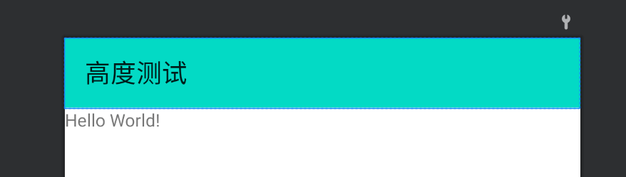


- paddingTop = 20时候， 如下的代码：

```
<androidx.appcompat.widget.Toolbar
    android:id="@+id/toolbar"
    android:layout_width="match_parent"
    android:layout_height="wrap_content"
    android:background="@color/teal_200"
    android:paddingTop="20dp"
    app:layout_constraintEnd_toEndOf="parent"
    app:layout_constraintStart_toStartOf="parent"
    app:layout_constraintTop_toTopOf="parent"
    app:title="高度测试" />
```

- 可以看到, Toolbar的总高度是不变的，内容高度下移20dp，这显然是不合理的；实际运行时动态为ToolBar添加statusbar的paddingTop肯定也会导致这样的问题 

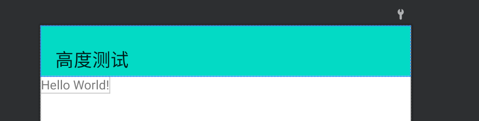


解决方案：

1、 使用FrameLayout等常见ViewGroup包住ToolBar，将paddingTop高度设置到FrameLayout中， 将颜色teal_200设置到FrameLayout

```
<FrameLayout
    android:id="@+id/layout_tool"
    android:layout_width="match_parent"
    android:layout_height="wrap_content"
    android:paddingTop="20dp"
    android:background="@color/teal_200">

    <androidx.appcompat.widget.Toolbar
        android:id="@+id/toolbar"
        android:layout_width="match_parent"
        android:layout_height="wrap_content"
        android:background="@color/teal_200"
        app:layout_constraintEnd_toEndOf="parent"
        app:layout_constraintStart_toStartOf="parent"
        app:layout_constraintTop_toTopOf="parent"
        app:title="高度测试" />

</FrameLayout>
```

如下：

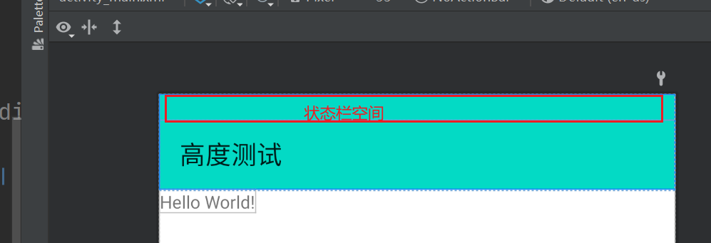


2、 在ToolBar外层直接封装FrameLayout（LinearLayout等也可， 下文统一用FrameLayout替代）；

我相信大家一般都不会直接使用原生的Toolbar， 每个公司或多或少的都封装了一些自定义ToolBar；按照上述1的思路， 我们不难发现： 

- 如果自定义ToolBar继承自FrameLayout（或者说Toolbar最外层被FrameLayout包住）， 直接将paddingTop加到自定义ToolBar即可；
- 当然有些做的好的公司可能会直接通过继承ViewGroup（如原生ToolBar）, 这个时候可能就只能用方案1了；

当然上述几点都是具体问题具体分析， 大家可以在预览界面临时加paddingTop，看看实际是什么样的， 便于大家尽早发现问题；可以参考下BottomNavigationView的源码， 它间接继承自FrameLayout, 内部对paddingBottom自动适配了navigation_bar_height;


这个思路和ImmersionBar的 [状态栏与布局顶部重叠解决方案]([https://github.com/gyf-dev/ImmersionBar#%E7%8A%B6%E6%80%81%E6%A0%8F%E4%B8%8E%E5%B8%83%E5%B1%80%E9%A1%B6%E9%83%A8%E9%87%8D%E5%8F%A0%E8%A7%A3%E5%86%B3%E6%96%B9%E6%A1%88%E5%85%AD%E7%A7%8D%E6%96%B9%E6%A1%88%E6%A0%B9%E6%8D%AE%E4%B8%8D%E5%90%8C%E9%9C%80%E6%B1%82%E4%BB%BB%E9%80%89%E5%85%B6%E4%B8%80](https://github.com/gyf-dev/ImmersionBar#状态栏与布局顶部重叠解决方案六种方案根据不同需求任选其一)) 类似，不同的是，ImmersionBar使用的是固定的高度，而方案1是动态监听状态栏的高度并设置FrameLayout的paddingTop；

**注：上述的paddingTop = 20dp， 只是方便预览添加的， 运行时请通过API动态设置paddingTop = statusBar**


### 2、 Bug&兼容性

直接使用Edge to edge（参照google官方文档）存在一个大坑：调用hide隐藏状态栏后会导致状态栏变黑， 并且内容区域无法铺满

详细描述看这里:point_right: [WindowInsetsControllerCompat.hide makes status bar background undrawable](https://www.reddit.com/r/androiddev/comments/s9ullg/windowinsetscontrollercompathide_makes_status_bar/)

```
private fun setWindowEdgeToEdge(window: Window) {
        WindowCompat.setDecorFitsSystemWindows(window, false)
        window.statusBarColor = Color.TRANSPARENT
        window.navigationBarColor = Color.TRANSPARENT
    }
    
WindowCompat.getInsetsController(this, this.decorView)?.let {
            it.systemBarsBehavior = behavior
            it.hide(WindowInsetsCompat.Type.statusBars())
        }    
```

具体表现下图这个样子：

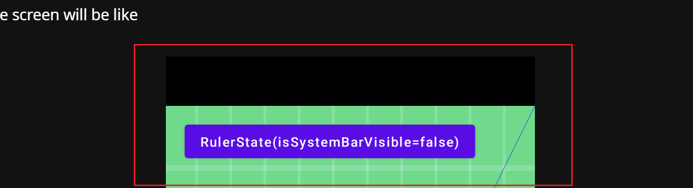

解决方案如下 :point_down:   [How to remove top status bar black background](https://stackoverflow.com/a/72773422/15859474)

```
object EdgeUtils {
    /** To fix hide status bar black background please using this post
     * youtube: https://www.youtube.com/watch?v=yukwno2GBoI
     * stackoverflow: https://stackoverflow.com/a/72773422/15859474
     * */
    private fun Activity.edgeToEdge() {
        requestWindowFeature(Window.FEATURE_NO_TITLE)
        if (Build.VERSION.SDK_INT >= Build.VERSION_CODES.P) {
            window.attributes.layoutInDisplayCutoutMode = WindowManager
                .LayoutParams
                .LAYOUT_IN_DISPLAY_CUTOUT_MODE_SHORT_EDGES
        }
        setWindowEdgeToEdge(this.window)
    }

    private fun setWindowEdgeToEdge(window: Window) {
        WindowCompat.setDecorFitsSystemWindows(window, false)
        window.statusBarColor = Color.TRANSPARENT
        window.navigationBarColor = Color.TRANSPARENT
    }
```


### 3、 如何去掉scrim？

在导航栏设置为全透明时， 部分机型就会出现scrim半透明遮罩，考虑到样式有点丑陋， 直接将其修改为`#01000000`, 这样看起来也是完全透明的， 但是系统判定其alpha不为0， 不会主动添加scrim的

```
private fun setWindowEdgeToEdge(window: Window) {
        WindowCompat.setDecorFitsSystemWindows(window, false)
        /** using not transparent avoid scrim*/
        Color.parseColor("#01000000").let { color ->
            window.statusBarColor = color
            window.navigationBarColor = color
        }
    }
```


### 4、 自动改变状态栏导航栏前景色？

ImmersionBar中，可以设置自动改变状态栏、导航栏前景色； 实现原理大致是监听状态栏、导航栏的背景色， 判断背景色是否达到深色阈值

如果背景为深色则前景色为浅色；反之前景色为深色； 不过对应的要求也很烦， 必须要存在状态栏...;  

但是EdgeUtils的原理是设置导航栏为透明色的, 因此上述方式不可靠；不过我们的思虑是否可以变更一下， 对一个View进行监听， 每当WindowInset变化时（可以获取状态栏、导航栏的高度），我们可以监听状态栏和导航栏的窗口区域， 在这个区域里面采样颜色值【注意不要采样到内容区了， 考虑到内容区和屏幕边缘存在margin， 因此采样是最好在屏幕边缘区进行】，从而判断颜色值是深色还是浅色； 最终调用API动态设置状态栏颜色值！


此外， 一个View只能绑定一个监听，因此最好是新增空白View来达到监听的目的；


## 参考文献

- [Android Detail:Window 篇-WindowInsets & fitsSystemWindow](https://juejin.cn/post/7038422081528135687)
- [Lay out your app within window insets](https://developer.android.com/develop/ui/views/layout/insets)
