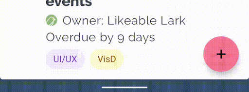
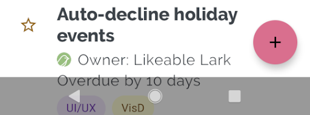
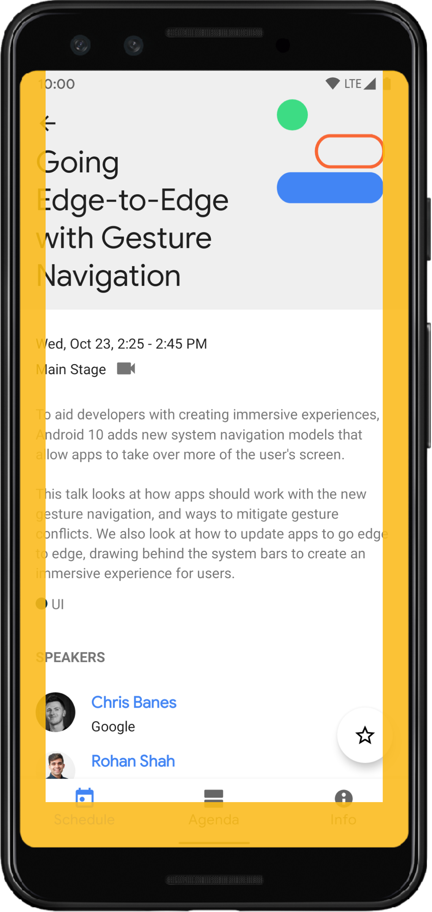
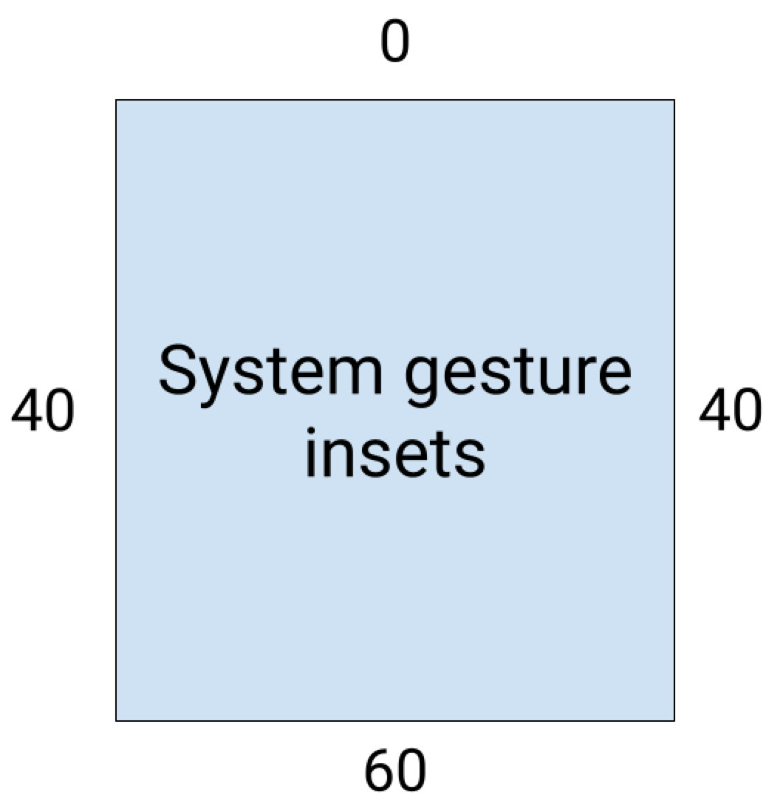
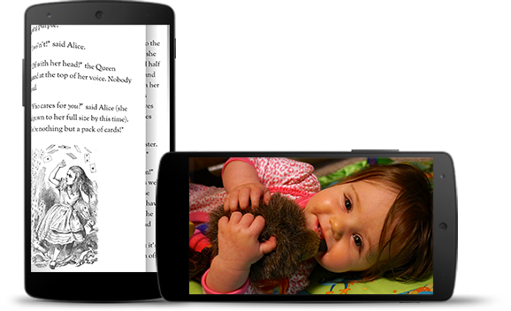

# [EdgeUtils](https://github.com/JailedBird/EdgeUtils)

## Edge To Edge

默认情况下，应用布局在顶部的状态栏(status bar)下方和底部导航栏(navigation bar)上方, 状态栏和导航栏一起称为系统栏(system bar)。但是应用可以将内容绘制到系统栏。**Edge-to-edge**中文释义是"边到边"， 如下图所示， "边到边"本质就是将应用内容(图中绿色部分)绘制到系统栏（图中白色位置）的位置，以此充分占用屏幕， 使其达到沉浸式的目的。


**Figure 3: System bars with edge-to-edge**

**Window insets** 即是系统UI和应用之间的相交、重叠的区域（上图白色区域， 表示Window insets的status bar和 navigation bar相交部分）


在应用中实现edge-to-edge的步骤如下：

1. Lay out your app full-screen. 
2. Change the system bar colors and transparency. 
3. Handle any visual overlaps. 


### Step 1: Lay out your app in full screen

这是确保应用实现edge-to-edge的主要步骤，使用 [WindowCompat.setDecorFitsSystemWindows(window, false)](https://developer.android.com/reference/androidx/core/view/WindowCompat#setDecorFitsSystemWindows(android.view.Window, boolean)) 将应用布局拓展到系统栏后面实现[**Figure 1**]的效果，代码如下 :arrow_down:

```
override fun onCreate(savedInstanceState: Bundle?) {
    super.onCreate(savedInstanceState)
    WindowCompat.setDecorFitsSystemWindows(window, false)
}
```


### Step 2: Change the system bar colors and transparency

在edge-to-edge布局中，应用需要更改导航栏和状态栏的颜色，以允许系统栏下面的应用内容可见， 默认建议直接将其设置透明；

应用执行此步骤后，系统会在手势导航模式（**Gesture navigation mode**）或按钮模式(**Button navigation mode**)下处理用户界面的所有视觉保护。

- 手势导航模式：系统导航条颜色根据其后面的内容改变颜色。在下面的示例中，如果导航栏中的控点高于浅色内容，则导航栏中的控点将更改为深色，反之亦然***（不要试图通过Api去改动这个颜色 一是不能、二是没必要）***

  

  **Figure 4**: Handle color changes in gesture navigation mode

- 按钮模式：系统在系统栏（对于 API 级别 29 或更高）或透明系统栏（对于 API 级别 28 或更低）后面应用半透明遮盖布局（scrim）***（将状态栏颜色设置为任意非透明颜色即可干掉这个半透明遮盖布局)***

  

   **Figure 5**: Translucent scrim behind system bars

  

- 状态栏内容颜色：此时状态栏透明， 应用内容会呈现在状态栏位置， 产生视觉冲突

  

  **Figure 6**: Status bar content color

  


**颜色控制具体步骤：**

编辑主题.xml文档以确保导航栏的颜色，并可选择将状态栏设置为透明，将状态栏内容颜色设置为深色*(建议通过代码去控制而非xml主题)*

```xml
<!-- values-v29/themes.xml -->
<style name="Theme.MyApp">
  <item name="android:navigationBarColor">
    @android:color/transparent
  </item>

  <!-- Optional: set to transparent if your app is drawing behind the status bar. -->
  <item name="android:statusBarColor">
    @android:color/transparent
  </item>

  <!-- Optional: set the status bar light and content dark. -->
  <item name="android:windowLightStatusBar">
    true
  </item>
</style>
```

可以使用  [WindowInsetsControllerCompat](https://developer.android.com/reference/androidx/core/view/WindowInsetsControllerCompat) API 而不是主题.xml来控制状态栏内容颜色。为此，请使用 [setAppearanceLightNavigationBars()](https://developer.android.com/reference/androidx/core/view/WindowInsetsControllerCompat#setAppearanceLightNavigationBars(boolean)) 函数，传入 true（将导航的前景色更改为浅色）或 false（设置为深色导航栏）

```
val windowInsetsController =
    ViewCompat.getWindowInsetsController(window.decorView)

windowInsetsController?.isAppearanceLightNavigationBars = true
```

通过Window的API可以直接改变状态栏颜色

```
private fun Window.edgeSetNavigationBarColor(@ColorInt colorInt: Int) {
        this.navigationBarColor = colorInt
    }
private fun Window.edgeSetStatusBarColor(@ColorInt colorInt: Int) {
        this.statusBarColor = colorInt
    }
```


### Step3：Handle any visual overlaps. 

实现具有颜色透明度的edge-to-edge布局后，应用的某些视图可能会绘制在系统栏后面


您可以通过对*insets* 监听来解决重叠问题，insets指定屏幕的哪些部分与系统 UI 相交，例如导航栏或状态栏；insets的相交含义不仅仅是视觉内容相交，也可以呈现和系统手势交互上的相交；


适用于从edge-to-edge显示应用的insets类型包括：  

- **System bars insets**: 这些insets描述可点击且不应被系统栏在视觉上遮挡的区域
- **System gesture insets**: 这些insets描述系统使用的优先于应用的手势导航区域


如：

- System bars insets
  - STATUS_BARS
  - NAVIGATION_BARS
  - CAPTION_BAR
  - IME
  - ...

- System gesture insets
  - SYSTEM_GESTURES
  - ...


#### System bars insets

System bar insets是最常用的insets类型，单纯的表示视觉上的交叉部分


例如，以下示例中的浮动操作按钮 （FAB） 被导航栏部分遮挡。


**Figure 7**: Navigation bar after edge-to-edge is implemented, with a visual overlap of the FAB


若要避免在手势模式或按钮模式下由edge-to-edge引起的这种视觉重叠，可以通过将  [getInsets(int)](https://developer.android.com/reference/androidx/core/view/WindowInsetsCompat#getInsets(int)) 与 [WindowInsetsCompat.Type.systemBars()](https://developer.android.com/reference/androidx/core/view/WindowInsetsCompat.Type#systemBars()) 一起使用来增加视图的边距。将此解决方案应用于图 6 中所示的示例将消除按钮模式和手势导航模式的视觉重叠，如Figure 7和Figure 7所示



**Figure 8**: Resolving visual overlap for button modes


 

**Figure 9**: Resolving visual overlap for gesture navigation mode (right)


上述效果的演示代码：

```kotlin
ViewCompat.setOnApplyWindowInsetsListener(view) { view, windowInsets ->
    val insets = windowInsets.getInsets(WindowInsetsCompat.Type.systemBars())
    // Apply the insets as a margin to the view. Here the system is setting
    // only the bottom, left, and right dimensions, but apply whichever insets are
    // appropriate to your layout. You can also update the view padding
    // if that's more appropriate.
    view.updateLayoutParams<MarginLayoutParams>(
      leftMargin = insets.left,
      bottomMargin = insets.bottom,
      rightMargin = insets.right,
  )

    // Return CONSUMED if you don't want want the window insets to keep being
    // passed down to descendant views.
    // WindowInsetsCompat.CONSUMED
    insets                                             
}
```


#### System gesture insets

System gesture insets表示窗口区域如下图的橙色所示，其中系统手势优先于您的app

 

**Figure 10**: System gesture insets

使用这些insets可将可轻扫视图(swipeable views )从边缘移开或填充。常见用例包括 [bottom sheets](https://material.io/design/components/sheets- bottom),、在游戏中滑动和使用 [ViewPager](https://developer.android.com/reference/androidx/viewpager2/widget/ViewPager2) 实现的轮播。


在 Android 10 或更高版本上，系统手势insets包含用于主页手势的底部insets，以及用于后退手势的左右insets：



**Figure 11**: System gesture inset measurements

```kotlin
ViewCompat.setOnApplyWindowInsetsListener(view) { view, windowInsets ->
    val insets = windowInsets.getInsets(WindowInsetsCompat.Type.systemGestures())
    // Apply the insets as padding to the view. Here we're setting all of the
    // dimensions, but apply as appropriate to your layout. You could also
    // update the views margin if more appropriate.
    view.updatePadding(insets.left, insets.top, insets.right, insets.bottom)

    // Return CONSUMED if we don't want the window insets to keep being passed
    // down to descendant views.
    // WindowInsetsCompat.CONSUMED
    windowInsets
}
```


### Step4：(Optional) Hide system bars for immersive mode

某些页面最好使用无状态栏、无导航栏的全屏去展示。如一些示例包括视频、游戏、图像库、书籍和幻灯片, 这称为沉浸式模式。这些页面通过全屏内容更深入地吸引用户。


 

**Figure12**: immersive mode sample 


请注意用户跳入和跳出应用以检查通知、执行即兴搜索或其他操作的频率。由于使用沉浸式会导致用户无法访问系统导航，因此仅当对用户体验的好处不仅仅是多一点点额外空间（例如，避免在游戏期间意外退出或为图像、视频和书籍提供有价值的沉浸式体验）时才使用沉浸式模式。

使用 [WindowInsetsControllerCompat.hide()](https://developer.android.com/reference/androidx/core/view/WindowInsetsControllerCompat#hide(int)) 隐藏系统栏，使用 [WindowInsetsController.show()](https://developer.android.com/reference/android/view/WindowInsetsController#show(int))将它们恢复。

以下代码片段显示了隐藏和显示系统栏的示例。

```kotlin
private fun hideSystemBars() {
    val windowInsetsController =
    ViewCompat.getWindowInsetsController(window.decorView) ?: return
    // Configure the behavior of the hidden system bars
    windowInsetsController.systemBarsBehavior =
    WindowInsetsControllerCompat.BEHAVIOR_SHOW_TRANSIENT_BARS_BY_SWIPE
    // Hide both the status bar and the navigation bar
    windowInsetsController.hide(WindowInsetsCompat.Type.systemBars())
}
```


您还可以指定要隐藏的系统栏的类型，还可以确定用户与系统栏交互时它们的行为。

#### Specify which system bars to hide

要指定要隐藏的系统条的类型，请将以下参数之一传递给[WindowInsetsControllerCompat.hide()](https://developer.android.com/reference/androidx/core/view/WindowInsetsControllerCompat#hide(int))

- 使用[WindowInsetsCompat.Type.systemBars()](https://developer.android.com/reference/kotlin/androidx/core/view/WindowInsetsCompat.Type#systembars) 隐藏两个系统栏
- 使用[WindowInsetsCompat.Type.statusBars()](https://developer.android.com/reference/kotlin/androidx/core/view/WindowInsetsCompat.Type#statusbars) 仅隐藏状态栏
- 使用[WindowInsetsCompat.Type.navigationBars()](https://developer.android.com/reference/kotlin/androidx/core/view/WindowInsetsCompat.Type#navigationbars) 仅隐藏导航栏

 

#### Specify behavior of hidden system bars

使用 [WindowInsetsControllerCompat.setSystemBarsBehavior()](https://developer.android.com/reference/androidx/core/view/WindowInsetsControllerCompat#setSystemBarsBehavior(int)) 指定隐藏的系统栏在用户与它们交互时的行为方式。

- 使用 [WindowInsetsControllerCompat.BEHAVIOR_SHOW_BARS_BY_TOUCH](https://developer.android.com/reference/androidx/core/view/WindowInsetsControllerCompat#BEHAVIOR_SHOW_BARS_BY_TOUCH) 在相应显示屏上显示任何用户交互的隐藏系统栏
- 使用 [WindowInsetsControllerCompat.BEHAVIOR_SHOW_BARS_BY_SWIPE](https://developer.android.com/reference/androidx/core/view/WindowInsetsControllerCompat#BEHAVIOR_SHOW_BARS_BY_SWIPE) 在任何系统手势上显示隐藏的系统栏，例如从隐藏栏的屏幕边缘轻扫
- 使用[WindowInsetsControllerCompat.BEHAVIOR_SHOW_TRANSIENT_BARS_BY_SWIPE](https://developer.android.com/reference/androidx/core/view/WindowInsetsControllerCompat#BEHAVIOR_SHOW_TRANSIENT_BARS_BY_SWIPE)  通过系统手势暂时显示隐藏的系统栏，例如从隐藏栏的屏幕边缘滑动。这些瞬态系统栏会覆盖应用的内容，可能具有一定程度的透明度，并在短时间超时后自动隐藏
