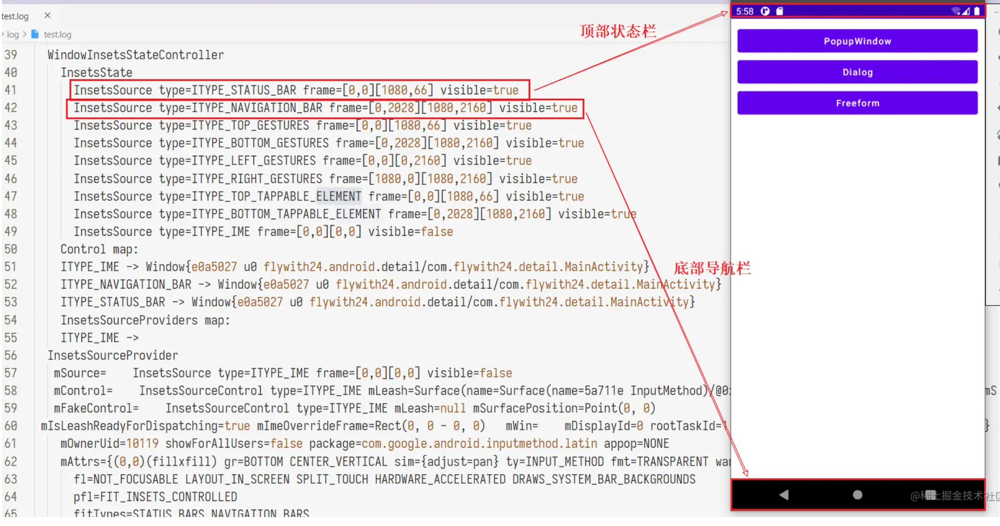
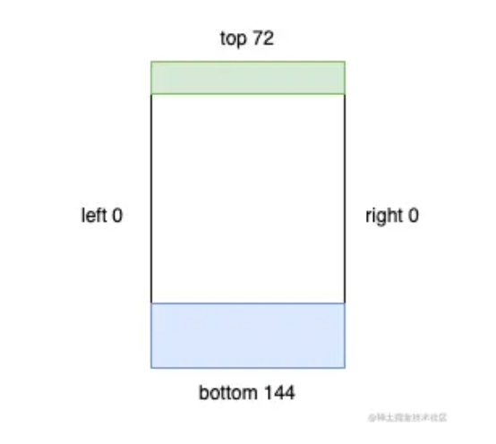

# [EdgeUtils](https://github.com/JailedBird/EdgeUtils)

[TOC]

文章会分为4个部分讲解Edge to edge的适配思路和EdgeUtils工具类

- 前言简介
  - Window Insets相关的知识
  - 传统沉浸式方案对比
- Edge to Edge
  - google官方edge适配的思路
  - 具体的代码做法
- EdgeUtils框架 :golf:
  - 框架API设计和实现
  - 基于edge和实际代码说明具体的适配方法
- 注意事项
  - 待优化的点
  - 缺陷和需要注意的事项


## 前言简介

文章摘要来自：[Flywith24](https://juejin.cn/user/219558054476792)的文章 [Android Detail:Window 篇-WindowInsets & fitsSystemWindow](https://juejin.cn/post/7038422081528135687) ，存在部分删减， 需要深入理解这一部分内容的同学可以看FlyWith24大佬的原文；


### 什么是Window

在 [Android Detail：Window 篇——站在 Window 视角理解 Activity 任务与返回栈](https://link.juejin.cn?target=https%3A%2F%2Fxiaozhuanlan.com%2Ftopic%2F3268795140) 一文中我们讨论过 Android Window 的核心概念并得到一个结论：

在 Android 中，暴露给开发者操作 UI 界面的 API 是 `mWindowManager.addView(rootView, windowParams);`

简单说，**Android 屏幕上的每一个 view 都是在 Window 内的**。

- 每个 Activity 有着自己的 Window（PhoneWindow），`Activity#getWindow()`
- Dialog 也有自己的 Window，`Dialog#getWindow()`
- PopupWindow、Toast 也是通过 `WindowManager#addView` 将 view 置于 Widnow 上的**（注意：它们没有自己的Window）**


### 什么是 Insets

屏幕上除了开发者 app 绘制的内容还有系统的 Insets（插入物），Insets 区域负责描述屏幕的哪些部分会与**系统 UI 相交**。如 `Starus bar` 或 `Navigation bar`：



**Figure1**

**上述的日志可以使用 `adb shell dumpsys activity top > ./test.log`** 导出, 日志的InsetsController结构中就会出现相关交叉部分的坐标

```
    InsetsController:
      InsetsState
        mDisplayFrame=Rect(0, 0 - 1080, 2400)
          InsetsSource type=ITYPE_STATUS_BAR frame=[0,0][1080,84] visible=true
          InsetsSource type=ITYPE_NAVIGATION_BAR frame=[0,0][0,0] visible=false
          InsetsSource type=ITYPE_LEFT_GESTURES frame=[0,0][0,0] 
          InsetsSource type=ITYPE_IME frame=[0,0][0,0] visibleFrame=[0,1417][1080,2400] visible=false
```

> 常见的 Insets 有：
>
> - `STATUS_BAR`，用于展示系统时间，电量，wifi 等信息
> - `NAVIGATION_BAR`，虚拟导航栏（区别于实体的三大金刚键），形态有**三大金刚键导航，手势导航**两种。（有些设备形态如 TV 没有导航栏）
> - `IME`，软键盘，用于输入文字

其中 `STATUS_BAR` 与 `NAVIGATION_BAR` 又被称为 `System bar`。

**（注：这是通过Insets解决问题的核心思路）如果开发者绘制的内容出现在了系统 UI 区域内，就可能出现视觉与手势的冲突。开发者可以借助 Insets 把 view 从屏幕边缘向内移动到一个合适的位置。**

在源码中，Insets 对象拥有 4 个 int 值，用于描述矩形四个边的偏移：



**Figure2**


> 📢 注意：不要把 Insets 的 `top` ，`bottom`，`left`，`right` 与 Rect 的搞混，前者描述的是**偏移**，后者是**坐标**。

关于 Insets 更详尽的信息，可以 [查看这篇文章](https://juejin.cn/post/6844904006343458830)。


### WindowInsets

`WindowInsets` 描述了一组 Window Content 的 Insets，未来可能会继续添加新的 Insets 类型。目前已有的 Insets 类型有：

```
static final int FIRST = 1 << 0;
        static final int STATUS_BARS = FIRST;
        static final int NAVIGATION_BARS = 1 << 1;
        static final int CAPTION_BAR = 1 << 2;

        static final int IME = 1 << 3;

        static final int SYSTEM_GESTURES = 1 << 4;
        static final int MANDATORY_SYSTEM_GESTURES = 1 << 5;
        static final int TAPPABLE_ELEMENT = 1 << 6;

        static final int DISPLAY_CUTOUT = 1 << 7;
```

`systemBars` API中包括 `Status bar`，`Navigation bar`，`Caption bar` (手势导航条模式)，但**不包括软键盘**（`ime`）, 当然开发者也通过位运算来任意组合这些insets

```
public static @InsetsType int systemBars() {
            return STATUS_BARS | NAVIGATION_BARS | CAPTION_BAR;
        }
```

上述**Figure1**中标注的状态栏和导航栏就对应 STATUS_BARS和NAVIGATION_BARS


### onApplyWindowInsets 与 setOnApplyWindowInsetsListener

了解了windows Insets, 那么如何通过insets实现沉浸式适配呢？ 

**开发者可以通过在自定义 View 中重写 `onApplyWindowInsets()` 方法或调用 `setOnApplyWindowInsetsListener()` 来监听 `WindowInsets` 的变化，通过对 View 添加 `margin` 或 `padding` 的方式处理解决冲突**。

这两个方法是互斥的，当存在 `OnApplyWindowInsetsListener` 时不会执行 `onApplyWindowInsets`：

```
public WindowInsets dispatchApplyWindowInsets(WindowInsets insets) {
        try {
            mPrivateFlags3 |= PFLAG3_APPLYING_INSETS;
            if (mListenerInfo != null && mListenerInfo.mOnApplyWindowInsetsListener != null) {
                return mListenerInfo.mOnApplyWindowInsetsListener.onApplyWindowInsets(this, insets);
            } else {
                return onApplyWindowInsets(insets);
            }
        } finally {
            mPrivateFlags3 &= ~PFLAG3_APPLYING_INSETS;
        }
    }
```


### System bar 能力变化史

篇幅过长，请直接查看原文 [Android 4.4到现在的System Bar变化](https://juejin.cn/post/7038422081528135687#heading-4)


### setSystemUiVisibility 与 WTFs

View 的源码中有一个 `setSystemUiVisibility() ` 的方法，虽然**该方法在 Android 11 已被弃用**，但按照本专栏的一贯风格，我们还是要来介绍一下该方法。

有些场景开发者可能希望 app 的内容可以绘制到状态栏或导航栏的区域以提供更好的用户体验，因此系统提供了 `setSystemUiVisibility` 方法，开发者可以通过向该方法传入不同的 flag 以应对不同的使用场景。

这些 flag 被称为 `Window Transform Flags`，简称 WTFs（滑稽脸😏），同样的，它们在 Android 11 中被弃用。常用的 flag 如下：

```
	@Deprecated
    public static final int SYSTEM_UI_FLAG_VISIBLE = 0;
    @Deprecated
    public static final int SYSTEM_UI_FLAG_LOW_PROFILE = 0x00000001;
    @Deprecated
    public static final int SYSTEM_UI_FLAG_HIDE_NAVIGATION = 0x00000002;
    @Deprecated
    public static final int SYSTEM_UI_FLAG_FULLSCREEN = 0x00000004;
    @Deprecated
    public static final int SYSTEM_UI_FLAG_LAYOUT_STABLE = 0x00000100;
    public static final int SYSTEM_UI_FLAG_LAYOUT_HIDE_NAVIGATION = 0x00000200;
    @Deprecated
    public static final int SYSTEM_UI_FLAG_LAYOUT_FULLSCREEN = 0x00000400;
    @Deprecated
    public static final int SYSTEM_UI_FLAG_IMMERSIVE = 0x00000800;
    @Deprecated
    public static final int SYSTEM_UI_FLAG_IMMERSIVE_STICKY = 0x00001000;
    @Deprecated
    public static final int SYSTEM_UI_FLAG_LIGHT_STATUS_BAR = 0x00002000;
    private static final int SYSTEM_UI_RESERVED_LEGACY1 = 0x00004000;
    private static final int SYSTEM_UI_RESERVED_LEGACY2 = 0x00010000;
    @Deprecated
    public static final int SYSTEM_UI_FLAG_LIGHT_NAVIGATION_BAR = 0x00000010;
    @Deprecated
    public static final int STATUS_BAR_HIDDEN = SYSTEM_UI_FLAG_LOW_PROFILE;
    @Deprecated
    public static final int STATUS_BAR_VISIBLE = SYSTEM_UI_FLAG_VISIBLE;
```

参数非常之多，且他们之前相互依赖、制约，导致效果多变、不稳定； 网络上也没几个人说的清楚，用起来一言难尽 :fu:


#### 获取 System bar 和 软键盘的高度

#### ❌ **错误(野路子)用法**

-  🙅🏻‍♀️固定 status bar 的高度，不同 Android 版本 `status bar` 的高度是不同的！不同设备也可能定制自己的高度。
-  🙅🏻‍♀️读取系统内部资源（framework 的 `dimens.xml` 存储了系列系统内部资源）				

`ImmersionBar`获取状态栏高度的方案：

```
static int getInternalDimensionSize(Context context, String key) {
        int result = 0;
        try {
            int resourceId = Resources.getSystem().getIdentifier(key, "dimen", "android");
            if (resourceId > 0) {
                int sizeOne = context.getResources().getDimensionPixelSize(resourceId);
                int sizeTwo = Resources.getSystem().getDimensionPixelSize(resourceId);

                if (sizeTwo >= sizeOne && !(Build.VERSION.SDK_INT >= Build.VERSION_CODES.Q &&
                        !key.equals(IMMERSION_STATUS_BAR_HEIGHT))) {
                    return sizeTwo;
                } else {
                    float densityOne = context.getResources().getDisplayMetrics().density;
                    float densityTwo = Resources.getSystem().getDisplayMetrics().density;
                    float f = sizeOne * densityTwo / densityOne;
                    return (int) ((f >= 0) ? (f + 0.5f) : (f - 0.5f));
                }
            }
        } catch (Resources.NotFoundException ignored) {
            return 0;
        }
        return result;
    }
```


`Blankj` 获取状态栏高度

```
public static int getStatusBarHeight() {
        Resources resources = Resources.getSystem();
        int resourceId = resources.getIdentifier("status_bar_height", "dimen", "android");
        return resources.getDimensionPixelSize(resourceId);
    }
public int getDimensionPixelSize(@DimenRes int id) throws NotFoundException {
        final TypedValue value = obtainTempTypedValue();
        try {
            final ResourcesImpl impl = mResourcesImpl;
            impl.getValue(id, value, true);
            if (value.type == TypedValue.TYPE_DIMENSION) {
                return TypedValue.complexToDimensionPixelSize(value.data, impl.getDisplayMetrics());
            }
            throw new NotFoundException("Resource ID #0x" + Integer.toHexString(id)
                    + " type #0x" + Integer.toHexString(value.type) + " is not valid");
        } finally {
            releaseTempTypedValue(value);
        }
    }
```


**「野路子」代码可能有效，但不健壮。**

#### ✅ 正确用法

使用 `WindowInsets#getInsets(type)` 获取对应 Insets，通过 Insets.top 或 Insets.bottom 获取 `System bar` 高度


### 总结

- 官方的API不香么:+1:


