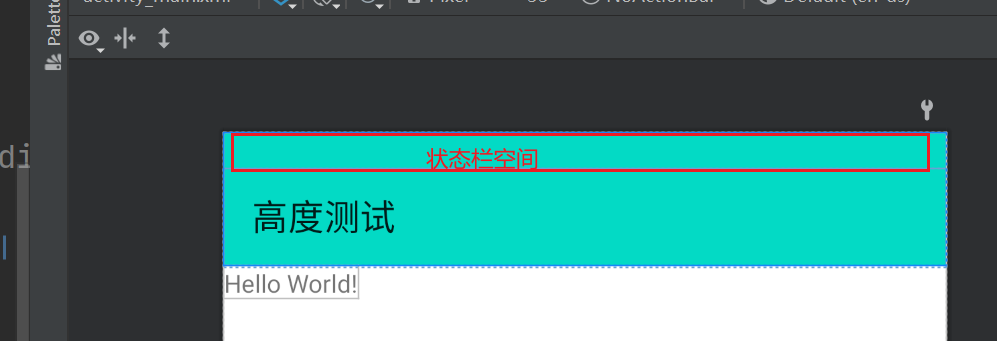

## [EdgeUtils](https://github.com/JailedBird/EdgeUtils)

此框架基于androidx.core， 对WindowInsets等常见API进行封装，提供了稳定的API和细节处理

EdgeUtils 常见API的函数名称通俗易懂，理解起来很容易， 难点是需要结合 [Edge-to-edge](#Edge to edge) 的原理去进行灵活适配各种界面


[项目中](https://github.com/JailedBird/EdgeUtils)存在三个demo对于各种常见的场景进行了处理和演示

- [immersion-sample](https://github.com/JailedBird/EdgeUtils/tree/master/immersionbar-sample) 基于开源项目immersionbar中的demo进行EdgeUtils的替换处理， 完成大部分功能的替换 （注：已替换的会标记[展示OK]）
- [navigation-sample](https://github.com/JailedBird/EdgeUtils/tree/master/navigation-sample) 基于Navigation的官方demo， 此demo展示了Navigation框架下这种单Activity多Fragment的沉浸式缺陷
- [navigation-edge-sample](https://github.com/JailedBird/EdgeUtils/tree/master/navigation-edge-sample) 使用此框架优化navigation-sample， 使其达到沉浸式的效果


### API格式

针对java风格， 我将所有的API直接封装到EdgeUtils文件中，按照固定格式调用即可

针对kotlin风格， 我将所有的上述java api都用kotlin拓展函数实现了一遍， 名称为 `(edge+java_merthod)`; 使用edge前缀约束是为避免拓展函数泛滥、和immersion bar、blankj BarUtils中API的名称冲突

EdgeUtils：

```
object EdgeUtils {
	/** judge has status bar*/
    @JvmStatic
    fun hasStatusBar(activity: Activity) = activity.window.edgeStatusBarsIsVisible()
    fun Activity.edgeHasStatusBar() = window.edgeStatusBarsIsVisible()

    /** get status bar height, please call it with View.post{}, otherwise it perhaps get 0 when
     * it not attach to view tree*/
    @JvmStatic
    fun statusBarHeight(activity: Activity) = activity.window.edgeStatusBarHeight()
    fun Activity.edgeStatusBarHeight(): Int = window.edgeStatusBarHeight()
	
	// xxx
}
```

EdgeUtils只是提供API调用， 具体的内部实现都是通过EdgeControl中提供的Window拓展函数； 注意EdgeControl使用internal修饰， 无法为模块外提供Window API， 这也是为了避免Window相关的API泛滥；

```
internal object EdgeControl {
    /** Status bar*/
    /**
     * About status bar WindowInsetsCompat [ViewCompat.getRootWindowInsets] from the top of the view
     * hierarchy or null if View is detached
     *
     * When use it, using View.post{ getCustomRootInset() } to
     * get NonNull WindowInsetsCompat
     */
    fun Window.edgeStatusBarsIsVisible() =
        getCustomRootWindowInsets()
            ?.isVisible(WindowInsetsCompat.Type.statusBars())
            ?: true

    fun Window.edgeStatusBarHeight() = getCustomRootWindowInsets()
        ?.getInsets(WindowInsetsCompat.Type.systemBars())?.top ?: 0

    fun Window.edgeStatusBarHeightIgnoringVisibility(): Int =
        getCustomRootWindowInsets()
            ?.getInsetsIgnoringVisibility(WindowInsetsCompat.Type.systemBars())?.top ?: 0

    fun Window.edgeShowStatusBar() =
        WindowCompat.getInsetsController(this, this.decorView)
            ?.show(WindowInsetsCompat.Type.statusBars())
	xxx
}
```


### 具体步骤

以[immersion-sample](https://github.com/JailedBird/EdgeUtils/tree/master/immersionbar-sample) 中的ParamActivity为例演示

#### 实现全屏

建议这个操作可以放在基类中

```
override fun onCreate(savedInstanceState: Bundle?) {
        super.onCreate(savedInstanceState)
        edgeToEdge()
        _binding = inflate.invoke(layoutInflater)
        setContentView(binding.root)
    }
```

注意`edgeToEdge()` 的实现

- 实现全屏
- 状态栏和导航栏默认设置为透明色底色
- 使用requestWindowFeature和layoutInDisplayCutoutMode修复一个隐藏较深的[缺陷](https://stackoverflow.com/a/72773422/15859474)

```
/**
     * Make activity implement edge-to-edge layout--> first step
     * */
    fun Activity.edgeToEdge() {
        /**
         * To fix [hide status bar cause black background] please reference this video
         * [youtube course](https://www.youtube.com/watch?v=yukwno2GBoI)
         * or [stackoverflow doc](https://stackoverflow.com/a/72773422/15859474)
         * */
        requestWindowFeature(Window.FEATURE_NO_TITLE)
        if (Build.VERSION.SDK_INT >= Build.VERSION_CODES.P) {
            window.attributes.layoutInDisplayCutoutMode = WindowManager
                .LayoutParams
                .LAYOUT_IN_DISPLAY_CUTOUT_MODE_SHORT_EDGES
        }
        setWindowEdgeToEdge(this.window)
    }
    
    /**
     * Edge to edge as google document: [edge-to-edge]( https://developer.android.com/develop/ui/views/layout/edge-to-edge#lay-out-in-full-screen)
     * */
    private fun setWindowEdgeToEdge(window: Window) {
        WindowCompat.setDecorFitsSystemWindows(window, false)
        window.statusBarColor = Color.TRANSPARENT
        window.navigationBarColor = Color.TRANSPARENT
    }
```


#### 解决视觉冲突

##### 导航栏

**方案1：**

使用FrameLayout包住Toolbar, 将颜色设置到FrameLayout， 然后动态添加FrameLayout的paddingTop接口

```
    <FrameLayout
        android:id="@+id/mEdgeLayout"
        android:layout_width="match_parent"
        android:layout_height="wrap_content"
        android:background="@color/btn13">

        <androidx.appcompat.widget.Toolbar
            android:id="@+id/mToolbar"
            android:layout_width="match_parent"
            android:layout_height="?attr/actionBarSize"
            android:background="@color/btn13"
            app:title="系统一些参数信息"
            app:titleTextColor="@android:color/white" />
    </FrameLayout>
```


```
binding.mEdgeLayout.paddingTopSystemWindowInsets()
```


paddingTopSystemWindowInsets是我们提供的View拓展函数， 在原有的padding基础上添加大小为系统栏特定值的padding

```
/** 给View添加状态栏高度的paddingTop*/
fun View.paddingTopSystemWindowInsets() =
    applySystemWindowInsetsPadding(applyTop = true)

/** 给View添加导航栏高度的paddingBottom*/
fun View.paddingBottomSystemWindowInsets() =
    applySystemWindowInsetsPadding(applyBottom = true)

/** 给View添加状态栏高度的paddingTop，导航栏高度的paddingBottom*/
fun View.paddingVerticalSystemWindowInsets() =
    applySystemWindowInsetsPadding(applyTop = true, applyBottom = true)

/** 自定义各种方向的padding*/  
fun View.applySystemWindowInsetsPadding(
    applyLeft: Boolean = false,
    applyTop: Boolean = false,
    applyRight: Boolean = false,
    applyBottom: Boolean = false,
) {
    doOnApplyWindowInsets { view, insets, padding, _ ->
        val systemBars = insets.getInsets(WindowInsetsCompat.Type.systemBars())
        val left = if (applyLeft) systemBars.left else 0
        val top = if (applyTop) systemBars.top else 0
        val right = if (applyRight) systemBars.right else 0
        val bottom = if (applyBottom) systemBars.bottom else 0

        view.setPadding(
            padding.left + left,
            padding.top + top,
            padding.right + right,
            padding.bottom + bottom
        )
    }
}

// 还有margin的类似API不再赘述
```

优点是可以动态监听状态栏高度的变化，缺点是需要给Toolbar加外层布局， 但是实际上通过FrameLayout或者LinearLayout等实现自定义Toolbar也可以直接使用paddingTop， 可以参考这里 [Toolbar通过paddingTop适配statusbar失效的问题](#1、 Toolbar通过paddingTop适配statusbar失效的问题)


**方案2**

状态栏加marginTop，然后通过API自行修改状态栏的颜色， 不过这样不太适合多Fragment结构， 单Activity倒是可以这么搞

**方案3**

在顶部加View， 然后代码动态获取状态栏高度， 并将其高度设置为状态栏高度， 有点是简单， 缺点是他是静态的， 状态栏高度变化时可能会失效

```
<View
        android:id="@+id/view"
        android:layout_width="match_parent"
        android:layout_height="0dp"
        android:background="@color/cool_green_normal" />
        
binding.view.post {
            val newLayoutParams = binding.view.layoutParams.apply {
                height = EdgeUtils.statusBarHeight(this@TabLayoutActivity)
            }
            binding.view.layoutParams = newLayoutParams
        }
```

注意**状态栏高度、状态栏的有无** 获取需要在View完成Attach的情况下， 因此加了`View.post` ， 对不不必过于担心， API中会存在提示， 提示开发者正确的用法

```
/**
     * hook [ViewCompat.getRootWindowInsets], some advantage as follows:
     * 1 avoid api change cause extensive modifications
     * 2 hook api do some judge, such as throw exception or toast some developer's tips
     * */
    private fun Window.getCustomRootWindowInsets(): WindowInsetsCompat? {
        val res = ViewCompat.getRootWindowInsets(this.decorView)
        if (res == null) {
            Toast.makeText(
                context,
                "ViewCompat.getRootWindowInsets(this.decorView) is null, please use View.post{ called_api } to ensure View has Attached",
                Toast.LENGTH_SHORT
            ).show()
        }
        return res
    }
```

**方案4：使用heightToTopSystemWindowInsets API** 监听方案3中的View， 不过这次改变的不是padding， 而是直接改变height， 且是动态改变的！

```
fun View.heightToTopSystemWindowInsets() {
    doOnApplyWindowInsets { view, insets, _, _ ->
        val systemBars =
            insets.getInsets(WindowInsetsCompat.Type.systemBars())
        view.layoutParams = view.layoutParams.apply {
            height = systemBars.top
        }
    }
}
```

相比方案三， 4是直接监听而非一次性设置，且不必使用View.post去延时设置！

类似的Api还有：heightToBottomSystemWindowInsets 用于底部导航栏的适配思路。

```
fun View.heightToBottomSystemWindowInsets() {
    doOnApplyWindowInsets { view, insets, _, _ ->
        val systemBars =
            insets.getInsets(WindowInsetsCompat.Type.systemBars())
        view.layoutParams = view.layoutParams.apply {
            height = systemBars.bottom
        }
    }
}
```


##### 导航栏适配

导航栏分为三种模式

- 完全的全面屏
- 手势模式（完全的全面屏的基础上添加导航条）
- 按钮模式（home、任务键、返回键）


完全的全面屏是最好适配的， 那就是啥也不适配

手势模式导航条前景色是不用控制的， 他是根据下方的色差自动变化的， 背景色设置为透明后理论上也不存在啥问题， 内容和完全的全面屏的呈现是一致的！

按钮模式比较麻烦， 部分设备底部导航栏设置透明色(alpha=0)后会存在颜色保护（半透明遮罩scrim）， 这种方式下适配 建议直接根布局加上marginBottom， 同时为避免遮罩层为导航栏设置一个自定义的颜色


综上， 处理导航栏的一般方法有：

- 根布局设置marginBottom = 导航栏高度， 然后去设置导航栏的底色和前景色， 实现适配
- 根布局设置paddingBottom= 导航栏高度， 然后去设置导航栏的底色和前景色， 实现适配

总之比较灵活吧，另外只要不影响布局内容的显示， 底部导航栏的适配的重要程度是不如状态栏的


建议操作：按照如下的方案先设置alpha!=0的透明， 先干掉scrim； API中暂时是改成了如下的颜色设置！

```
private fun setWindowEdgeToEdge(window: Window) {
        WindowCompat.setDecorFitsSystemWindows(window, false)
        /** using not transparent avoid scrim*/
        Color.parseColor("#01000000").let { color ->
            window.statusBarColor = color
            window.navigationBarColor = color
        }
    }
```

然后底部根布局直接paddingBottom = navigation_height， 然后就可以了！ (当然直接设置marginBottom也可， 不过需要另外控制导航栏颜色)


如果底部加对话框弹窗， 就得换个思路玩了,  请参考 [WechatActivity](https://github.com/JailedBird/EdgeUtils/blob/master/immersionbar-sample/src/main/java/com/gyf/immersionbar/sample/activity/WechatActivity.kt) 和[LoginActivity](https://github.com/JailedBird/EdgeUtils/blob/master/immersionbar-sample/src/main/java/com/gyf/immersionbar/sample/activity/LoginActivity.kt)


## 注意事项


### 1、 Toolbar通过paddingTop适配statusbar失效的问题

很多时候， 状态栏的颜色和ToolBar的颜色是一致的， 这种情况下我们可以想到为ToolBar加 `paddingTop = status_bar_height`， 但是注意androidx.appcompat.widget.Toolbar 继承自ViewGroup， `androidx.appcompat.widget.Toolbar#onMeasure` 和 `onLayout` 中的测量高度和摆放方式我不太懂（对自定义View理解不是很深刻）； 但是感觉是不会算入padding的，等价于height=wrap_content的Toolbar高度是固定的（假设为80dp）

可以看下下面的2个例子：

-  paddingTop = 0时候， 如下的代码：

```
<androidx.appcompat.widget.Toolbar
    android:id="@+id/toolbar"
    android:layout_width="match_parent"
    android:layout_height="wrap_content"
    android:background="@color/teal_200"
    android:paddingTop="0dp"
    app:layout_constraintEnd_toEndOf="parent"
    app:layout_constraintStart_toStartOf="parent"
    app:layout_constraintTop_toTopOf="parent"
    app:title="高度测试" />
```

- UI预览可以看到是这个样子的：


- paddingTop = 20时候， 如下的代码：

```
<androidx.appcompat.widget.Toolbar
    android:id="@+id/toolbar"
    android:layout_width="match_parent"
    android:layout_height="wrap_content"
    android:background="@color/teal_200"
    android:paddingTop="20dp"
    app:layout_constraintEnd_toEndOf="parent"
    app:layout_constraintStart_toStartOf="parent"
    app:layout_constraintTop_toTopOf="parent"
    app:title="高度测试" />
```

- 可以看到, Toolbar的总高度是不变的，内容高度下移20dp，这显然是不合理的；实际运行时动态为ToolBar添加statusbar的paddingTop肯定也会导致这样的问题


解决方案：

1、 使用FrameLayout等常见ViewGroup包住ToolBar，将paddingTop高度设置到FrameLayout中， 将颜色teal_200设置到FrameLayout

```
<FrameLayout
    android:id="@+id/layout_tool"
    android:layout_width="match_parent"
    android:layout_height="wrap_content"
    android:paddingTop="20dp"
    android:background="@color/teal_200">

    <androidx.appcompat.widget.Toolbar
        android:id="@+id/toolbar"
        android:layout_width="match_parent"
        android:layout_height="wrap_content"
        android:background="@color/teal_200"
        app:layout_constraintEnd_toEndOf="parent"
        app:layout_constraintStart_toStartOf="parent"
        app:layout_constraintTop_toTopOf="parent"
        app:title="高度测试" />

</FrameLayout>
```

如下：




2、 在ToolBar外层直接封装FrameLayout（LinearLayout等也可， 下文统一用FrameLayout替代）；

我相信大家一般都不会直接使用原生的Toolbar， 每个公司或多或少的都封装了一些自定义ToolBar；按照上述1的思路， 我们不难发现：

- 如果自定义ToolBar继承自FrameLayout（或者说Toolbar最外层被FrameLayout包住）， 直接将paddingTop加到自定义ToolBar即可；
- 当然有些做的好的公司可能会直接通过继承ViewGroup（如原生ToolBar）, 这个时候可能就只能用方案1了；

当然上述几点都是具体问题具体分析， 大家可以在预览界面临时加paddingTop，看看实际是什么样的， 便于大家尽早发现问题；可以参考下BottomNavigationView的源码， 它间接继承自FrameLayout, 内部对paddingBottom自动适配了navigation_bar_height;


这个思路和ImmersionBar的 [状态栏与布局顶部重叠解决方案]([https://github.com/gyf-dev/ImmersionBar#%E7%8A%B6%E6%80%81%E6%A0%8F%E4%B8%8E%E5%B8%83%E5%B1%80%E9%A1%B6%E9%83%A8%E9%87%8D%E5%8F%A0%E8%A7%A3%E5%86%B3%E6%96%B9%E6%A1%88%E5%85%AD%E7%A7%8D%E6%96%B9%E6%A1%88%E6%A0%B9%E6%8D%AE%E4%B8%8D%E5%90%8C%E9%9C%80%E6%B1%82%E4%BB%BB%E9%80%89%E5%85%B6%E4%B8%80](https://github.com/gyf-dev/ImmersionBar#状态栏与布局顶部重叠解决方案六种方案根据不同需求任选其一)) 类似，不同的是，ImmersionBar使用的是固定的高度，而方案1是动态监听状态栏的高度并设置FrameLayout的paddingTop；

**注：上述的paddingTop = 20dp， 只是方便预览添加的， 运行时请通过API动态设置paddingTop = statusBar**


### 2、 Bug&兼容性

直接使用Edge to edge（参照google官方文档）存在一个大坑：调用hide隐藏状态栏后会导致状态栏变黑， 并且内容区域无法铺满

详细描述看这里:point_right: [WindowInsetsControllerCompat.hide makes status bar background undrawable](https://www.reddit.com/r/androiddev/comments/s9ullg/windowinsetscontrollercompathide_makes_status_bar/)

```
private fun setWindowEdgeToEdge(window: Window) {
        WindowCompat.setDecorFitsSystemWindows(window, false)
        window.statusBarColor = Color.TRANSPARENT
        window.navigationBarColor = Color.TRANSPARENT
    }
    
WindowCompat.getInsetsController(this, this.decorView)?.let {
            it.systemBarsBehavior = behavior
            it.hide(WindowInsetsCompat.Type.statusBars())
        }    
```

具体表现下图这个样子：


解决方案如下 :point_down:   [How to remove top status bar black background](https://stackoverflow.com/a/72773422/15859474)

```
object EdgeUtils {
    /** To fix hide status bar black background please using this post
     * youtube: https://www.youtube.com/watch?v=yukwno2GBoI
     * stackoverflow: https://stackoverflow.com/a/72773422/15859474
     * */
    private fun Activity.edgeToEdge() {
        requestWindowFeature(Window.FEATURE_NO_TITLE)
        if (Build.VERSION.SDK_INT >= Build.VERSION_CODES.P) {
            window.attributes.layoutInDisplayCutoutMode = WindowManager
                .LayoutParams
                .LAYOUT_IN_DISPLAY_CUTOUT_MODE_SHORT_EDGES
        }
        setWindowEdgeToEdge(this.window)
    }

    private fun setWindowEdgeToEdge(window: Window) {
        WindowCompat.setDecorFitsSystemWindows(window, false)
        window.statusBarColor = Color.TRANSPARENT
        window.navigationBarColor = Color.TRANSPARENT
    }
```


### 3、 如何去掉scrim？

在导航栏设置为全透明时， 部分机型就会出现scrim半透明遮罩，考虑到样式有点丑陋， 直接将其修改为`#01000000`, 这样看起来也是完全透明的， 但是系统判定其alpha不为0， 不会主动添加scrim的

```
private fun setWindowEdgeToEdge(window: Window) {
        WindowCompat.setDecorFitsSystemWindows(window, false)
        /** using not transparent avoid scrim*/
        Color.parseColor("#01000000").let { color ->
            window.statusBarColor = color
            window.navigationBarColor = color
        }
    }
```


### 4、 自动改变状态栏导航栏前景色？

ImmersionBar中，可以设置自动改变状态栏、导航栏前景色； 实现原理大致是监听状态栏、导航栏的背景色， 判断背景色是否达到深色阈值

如果背景为深色则前景色为浅色；反之前景色为深色； 不过对应的要求也很烦， 必须要存在状态栏...;

但是EdgeUtils的原理是设置导航栏为透明色的, 因此上述方式不可靠；不过我们的思虑是否可以变更一下， 对一个View进行监听， 每当WindowInset变化时（可以获取状态栏、导航栏的高度），我们可以监听状态栏和导航栏的窗口区域， 在这个区域里面采样颜色值【注意不要采样到内容区了， 考虑到内容区和屏幕边缘存在margin， 因此采样是最好在屏幕边缘区进行】，从而判断颜色值是深色还是浅色； 最终调用API动态设置状态栏颜色值！


此外， 一个View只能绑定一个监听，因此最好是新增空白View来达到监听的目的；


## 参考文献

- [Android Detail:Window 篇-WindowInsets & fitsSystemWindow](https://juejin.cn/post/7038422081528135687)
- [Lay out your app within window insets](https://developer.android.com/develop/ui/views/layout/insets)
